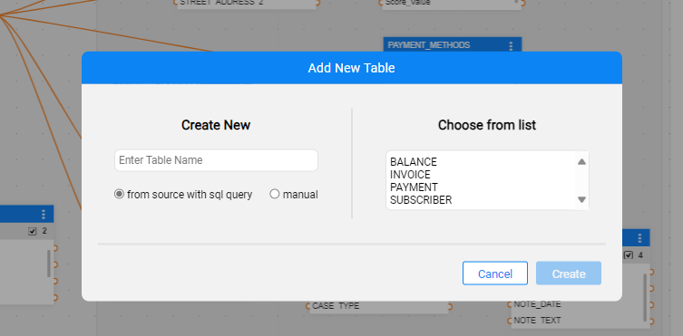

# Adding a Table to an LU Schema

An [LU table](/articles/06_LU_tables/01_LU_tables_overview.md)  is a basic building block in a Logical Unit (LU).

The following are some of the methods you can use for adding a table to an [LU schema](/articles/03_logical_units/03_LU_schema_window.md). 

<studio>

While using one of the first three methods, the tables are also created in Fabric LU and then added to the schema. The last one enables adding an existing LU table, which is not in use in the schema.

1. Use the [Auto Discovery Wizard](/articles/03_logical_units/06_auto_discovery_wizard.md) for creating tables and their populations and adding them to the LU schema.

2. Use the [DB Objects tab](/articles/03_logical_units/03_LU_schema_window.md#logical-unit-lu-tabs) appears at the right side of the [LU schema](/articles/03_logical_units/03_LU_schema_window.md) window:

   * Click on the DB Objects tab.
   * Click **DB Connection** and select a [DB interface](/articles/05_DB_interfaces/03_DB_interfaces_overview.md) from the drop-down menu.
   * From the window underneath the **DB Connection** drop-down menu, open the table tree, select a **Table**, open its drop-down menu and drag the table from its title into the **LU schema**. You can drag several tables at the same time.
   * A right-click menu appears; select one of the following from it: **Create Table Based DB Query** or **Create Table Based Root Function** or **Create Table Based Broadway Flow**.

   The selected table or tables are automatically created with the selected type of [population](/articles/07_table_population/01_table_population_overview.md) and added to the LU schema.

      

   

3. Right click the **Schema window** and select one of the following options:

    * **New Table from SQL Based DB Query**.
    * **New Table from SQL Based Root Function**.
    
    * **New Table from SQL Based Broadway Flow**.
    

    All the above 3 options open the Query Builder. The LU table and its populations are automatically generated, based on an SQL query defined in the Query Builder.
    
    

4. Drag a **Table** into the **LU Schema window**:

   * Go to the [Objects tab](/articles/03_logical_units/03_LU_schema_window.md#logical-unit-lu-tabs) of the [LU schema](/articles/03_logical_units/03_LU_schema_window.md).

   * Select a **Table** and drag it into the **LU Schema window**.
   
      

[Click for more information about LU Table Creation.](/articles/06_LU_tables/02_create_an_LU_table.md)  

[Click for more information about LU Tables and Table Population.](/articles/07_table_population/01_table_population_overview.md)

[Click for more information about Broadway Population.](/articles/07_table_population/14_table_population_based_Broadway.md)

</studio>

<web>

While using one of the first two methods, the tables are also created in Fabric LU and then added to the schema. The last one enables adding an existing LU table, which is not in use in the schema.

1. From the **DB Interface Explorer**, click on the  icon from the Activity panel on the left as described [here](/articles/03_logical_units/05_create_a_new_LU_object.md). This option is useful when you wish to add tables from data sources.

2. From the **Project Explorer**, open your Logical Unit > Schema and on the [LU schema](/articles/03_logical_units/03_LU_schema_window.md) window top bar, click the  icon to open the **Add New Table** popup window, where you can choose one of three options:

   * Create New from source with SQL query
   
   * Create New manually
   
   * Choose from list
   
     

 
<b>Create New from Source with SQL Query</b> 
<ol>
<li>Name the table and click on Create. Query Builder popup window appears.</li>
<li>In the Query Builder window, select the required interface. Then either write the SQL query in the upper part in the Query Builder or expand the interface schema and table list to find the relevant table and select it.</li>

<li>Once a query exists in the Query Builder, you can test it by clicking on **Execute** button. When done, click on **Create** button.</li>

</ol>    

#### 

Choose From List

Select the table from the list of tables. The drop-down menu displays the existing tables in the LU that are not a part of the schema.

#### Create New Manually

Name the table and click on **Create**. A new empty table popup window appears.

Define and populate the table's columns: 

* When populating a column with a name and moving on to populate the next column, a new row is automatically added at the bottom of the table.
* Once the table contains several columns, you can reorganize them by using the drag and drop method, by clicking on  icon.

The table is automatically created (unless already exists and just added to the schema) with the [population](/articles/07_table_population/14_table_population_based_Broadway.md) and is added to the LU schema.

   

</web>

