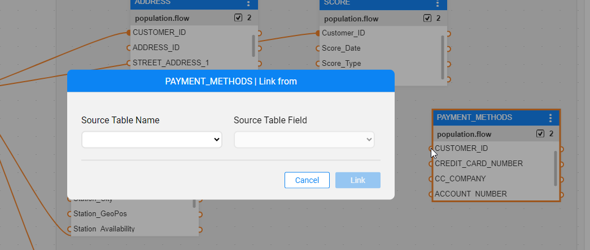
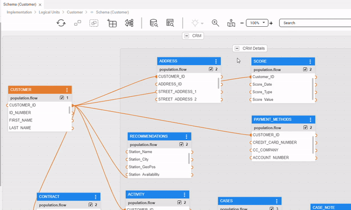

# LU Tables' Hierarchy and Linking Populations

## Table Population Links Overview
An LU schema structure displays a hierarchical presentation of data related to the Root Table. Parent-child links in LU tables are created via their Table Population objects :
* Each LU table can have one or several Table Population objects. Each such object - except the Table Population object of the Root LU table - should be linked to a parent table via its [input arguments](/articles/03_logical_units/12_LU_hierarchy_and_linking_table_population.md#what-are-the-table-populations-input-arguments). 

* Each Table Population object can be linked to a different parent LU table.

  **For instance:** an ADDRESS LU table is populated with 2 populations: 

  * Population 1, populates the customer’s billing address. It is linked to the CUSTOMER table and selects the source address records belonging to the CUSTOMER_ID.

    <studio>

    

    </studio>

    <web>

    

    </web>

  * Population 2, populates the installation address of each subscription. It is linked to the SUBSCRIBER table and it selects the source address records belonging to the SUBSCRIBER_ID.

    <studio>

    

    </studio>

    <web>

    

    </web>

* A link from a Table Population object to a parent LU table can be based on several columns, all of which should be linked to the **same parent LU table**.

  <studio>

  * **Example 1:** The INVOICE Table Population object can be linked to the BALANCE LU table by 2 columns: SUBSCRIBER_ID and BALANCE. This is a valid link.

    

  * **Example 2:** Linking the INVOICE Table Population object to 2 different LU tables - BALANCE and SUBSCRIBER is invalid.

    

    </studio>

    <web>

  * **Example 1:** The CASE_NOTE Table Population object can be linked to the CASES LU table by 2 columns: CASE_ID and NOTE_DATE. This is a valid link.

    

  * **Example 2:** Linking the CASE_NOTE Table Population object to 2 different LU tables - CASES and ACTIVITY - is invalid; a validation error will be displayed in the Problems panel when trying to save. 

    

    </web>

**Note:** An LU table can be added to an LU schema without a Table Population object. Such table is not populated by the sync of the instance, but rather by a separate transaction.

## Table Population's Input Arguments
<web>

Input arguments of a population flow are defined by the **PopulationArgs** Actor's input argument that must be set to an **External** population type.

Each population flow should have at least one Input parameter. A Root table's population can have only one input argument, which is populated by the Instance ID.

[Click for more information about population flows.](/articles/07_table_population/14_table_population_based_Broadway.md)

[Click for more information about an Actor's input parameters.](/articles/19_Broadway/03_broadway_actor_window.md#actors-inputs-and-outputs)

</web>

<studio>

Input arguments are a property of the [Source Object](/articles/01_fabric_overview/02_fabric_glossary.md#source-object) of a Table Population object.

There are [2 types of Source Objects](/articles/07_table_population/02_source_object_types.md) for a Table Population object:
* DB query
* Root function

**DB Query**
* A DB query Table Population object can be linked to a parent table via its input argument fields. Only input arguments that are defined as True can be linked to parent tables.
* In the DB query of a Root Table, only one field can be defined as True and it is populated by the [Instance ID](/articles/01_fabric_overview/02_fabric_glossary.md#instance-id).
* Other LU Tables can have several fields defined as input arguments. 

**Root Function**
* Each root function must have at least one Input parameter.
* A population can be linked to a parent table via its Input parameters based on a Root function. 
* The Root function of a Root Table can have only one Input parameter and it is populated by the Instance ID.

[Click for more information about Table Population Types.](/articles/07_table_population/02_source_object_types.md#table-population---source-object-types)

## Edit the Input Arguments in a DB Query
When creating a DB query, by default all Input fields are set to True.  

To edit an Input argument, do the following: 

Click the **source object** of the Population window (the DB query) and verify that the fields that should be linked to the **parent table** are set to **True**. Other fields that do not need to be linked to a parent table, can be set to **False**. 

</studio>

## Linking Tables
A link can be added in both directions:
* **Child to parent** - linking the child table population to a parent table.
* **Parent to child** - linking a parent table to a child table population.

You can link them by either dragging a connection line or by using the Tables Connection Assistance popup window, as follows:

### Link a Child Table Population to a Parent Table
1. Click the Population name of the child table.

2. Connect each **input field** to a **parent table** using one of the following methods:

   - Drag the **connection line** from this field into the **parent table** and **column**.

   - <studio>Right-click on this field, select **Add link from** > **parent table** > **column**.</studio>

   - <web>Right-click on this field connector, select the source table and then select source table field.</web>

     <web>

     

​	</web>

### Link a Parent Table to a Child Table Population

1. Click the **parent table**.
2. Connect each **parent column** to the **child population** using one of the following methods:

   - Click the **child population** header and drag the **connection line** to the **parent table** and **column**.

   - <studio>Right-click, select **Add link to** > **child population** > **column**.</studio>

   - <web>Right-click on this field output connector, select the target table, the target table population and then the target input field.</web>

     <web>

     

   ​	</web>

> **Note:** Link all the Input fields of the selected Table Population object to one parent table. A Table Population object cannot be linked to several parent tables. 

<web>

## Highlight Table Population Links

In complex and large schemas, it is sometimes difficult to track the population link, from which table it comes and/or to which tables it goes. For this reason, you can click on it and then you can see it as a dashed animated line.

</web>

## Delete Table Population Links

<studio>Either click on the link and press the **Delete** key or right-click and select **Delete**</studio>.
<web>Click on the link and press the **Delete** key.</web>

