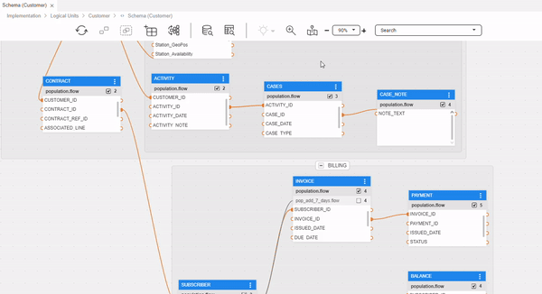

<web>

# Schema Tables' Highlighting

When maintaining large logical units with many tables, it becomes difficult to understand and manage a complex schema. The Tables' Highlighting feature enables to highlight some of the tables and bring them into focus.

## Highlighting Connected Tables 

Highlighting connected tables helps you to better understand the connection and relations between tables, especially in large schemas, by highlighting related tables.

### Activate Highlighting

To activate the highlighting feature: 

1. First, select a table with connections to other tables that you wish to see. 

2. Choose to highlight by either:

   - Click on the schema's top bar **highlighting bulb** action icon ( ). 

   - Open the table menu (ellipsis, 3 dot menu) and choose **Highlight by relation**

     

3. Select one of the following highlighting option types:

   - Only connected tables, All connected tables - predecessors and successors
   - Only predecessors
   - Only successors

Once chosen, all other tables become blurred. Additionally, the highlighting bulb icon in the schema' top bar turns orange, indicating that the highlighting feature is currently turned-on.

> **Hint**: The activated highlighting type can be quickly revealed as a tooltip when hovering the mouse over the highlighting bulb icon. (You can also click on the down arrow symbol, located next to it, in the schema's top bar, and look for the 'v' sign). 

> **Note**: When the Tables' Highlighting feature is turned-on, other tables are still available and active.

### Deactivate Highlighting

To deactivate the highlighting feature and turn it off, either click on the highlighting bulb icon, or click on the highlighting down arrow and then on the selected highlighting option.

### Change Highlighting Type

In case the highlighting feature is turned-on and you wish change the highlighting option type (for example, from focusing on all connected tables to focusing on only predecessors), click on the highlighting down arrow and select the desired option.

</web>
