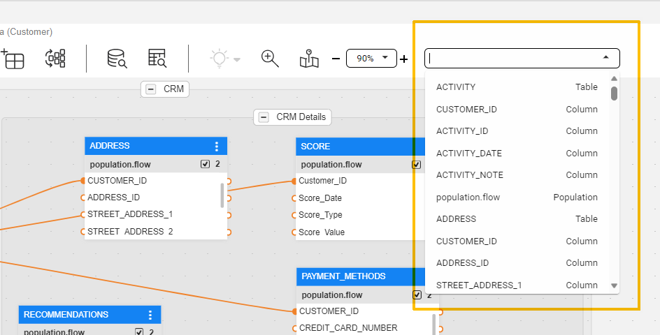
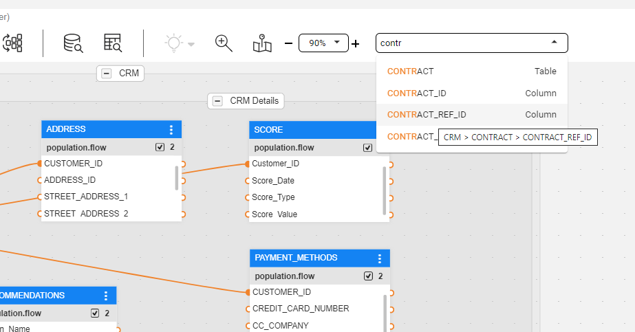
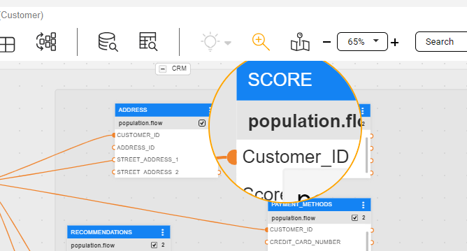

<web>

# Big Schema Productivity Tips

When maintaining large logical units with many tables, it sometimes becomes difficult to understand and manage their complex schemas. This article suggests several features and productivity tips that may in such case.

## Schema Search 

Use the schema Search input field for looking for tables, table-groups, tables' columns, populations and their input fields.

To do so, first tap the search box located at the schema's top toolbar. Once done, the search box expands into a result widget, displaying all schema tables in an alphabetical order, along with their related elements (columns and populations). The element type appears besides each element name.

You can type a keyword into the search box where then the result widget displays all the occurrences of the searched text.

* The results show the entire element name containing the searched text, which is highlighted in orange. 

* Hovering over an entry in the search result widget triggers a tooltip that indicates the location of the searched text in the schema hierarchy. For example (shown in the below screenshot): "CRM > CONTRACT > CONTRACT_REF_ID". In this example, "CRM" is the name of the group (which is optional), then table name and column, as hovering done on a table's column. 

  

* Clicking on an entry takes you directly to the element location, either the group or to the table, and selecting it.

## Navigation Mini Map

You can have an overview of the whole schema's diagram using the Navigation Map feature.  on schema's top bar Magnifier control icon ()  to activate it. 

Once Opened - at the top left side of the schema diagram window, you can click and move the red rectangle, which represent the current schema view. In this way you can navigate in the schema.

When clicked, in addition to the navigation map itself that appears, the Navigation Map icon becomes orange colored, indicating it is turned-on. To turn it off, click on this control icon again.

## Zoom In and Out

You can focus on a specific area or to have a wider view on the schema's diagram and its tables, by using the Zoom in and out top bar control. Use the "+" and "-" controls to smoothly zoom (5% each click) or select one of the predefined zoom values using the select list options.  

## Magnifier

When schema diagram is zoomed out, usually happened in big LUs with complex diagram,  where tables looks small, you can use the Magnifier control to magnify areas in the schema. click on schema's top bar Magnifier control icon () to activate it. 

When clicked, in addition to the magnifier itself that appears on the schema diagram, the Magnifier icon becomes orange colored, indicating it is turned-on. 

To turn it off and deactivate the magnifier, click on this control icon again.

> Note: while Magnifier is activated, all actions are still available, also a the magnified elements. 

## Highlighting Tables and Links

Highlighting Connected Tables feature helps you to better understanding the connection and relations between tables, especially in big schemas, by highlighting related tables. Use the schema's top bar highlighting bulb control icon ( )  to activate it. Read [here](/articles/03_logical_units/20_LU_highlight_tables.md) to learn about this feature.

## Connecting Tables

In big schema sometimes it is hard to connect tables which are located far each from the other, by drawing a link. Instead, you can right click on the input field connector (at the "child" table) or outer field connector (at the the "parent" table) and use the opened popup to set the connection. Read [here](/articles/03_logical_units/12_LU_hierarchy_and_linking_table_population.md#linking-tables.md) to learn about this feature.

## Population Order Overview

Studio provides a Population Order View that make it easy to understand and manage when each table is populated during an LUI's sync process. This view is accessible using the right schema tab, aside the Schema's properties. Read [here](/articles/03_logical_units/19_LU_population_order_view.md) to learn about this feature.

</web>
