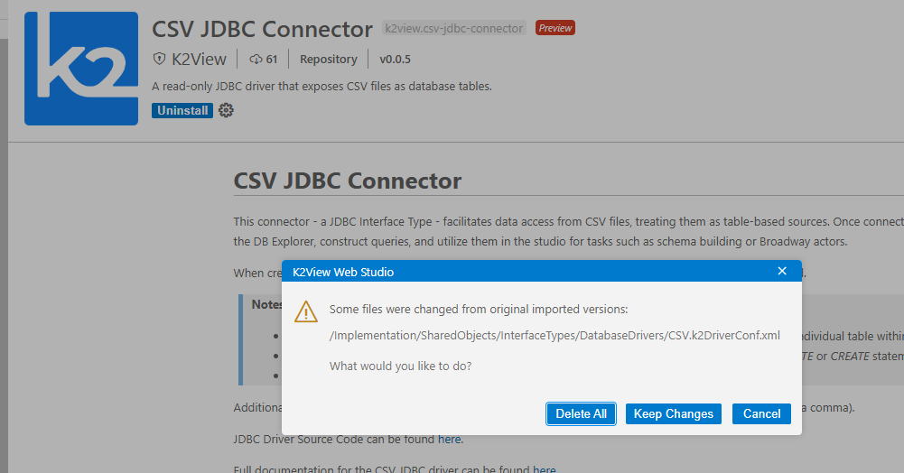

<web>

# K2exchange

The K2exchange is a store-like platform for publishing and consuming Fabric’s modules that are not part of the product and that are hence considered as extensions. Such extension modules can be Broadway actors and flows, connectors, templates, Java code and lib, LU web-app and SQL queries. 

Project implementors can explore the extensions list, through the Web Studio, install and embed them into their project with a click, to support their development workflow.

Additionally, the Web Studio provides tools for creating, packing and publishing extensions to the K2exchange store.

## Browse for Extensions

You can browse and install extensions from within the Web Studio. Access the **Extensions** view by clicking on the Extensions icon in the **Activity Bar** on the left side of the Studio (), by choosing it at the top View menu > Extensions, or by using View: Extensions keyboard short - Mac: `⇧⌘X`, Windows/Linux: `Ctrl+Shift+X`.

This will present you with a list of the extensions on the K2exchange. Each of the extensions in the list includes a brief description and its publisher. With a mouse hover, you can see a pop-up tooltip that contains more information about the extension, such as its latest version. When selecting an extension item, the extension's details page displays on the right side of the screen, where you can learn more about it.

> The extension list is divided into several sub-lists, such as *INSTALLED*, which can be useful when the main *K2 EXCHANGE* list includes many extensions and you wish to see only the installed ones.

## Install an Extension

To install an extension, select the **Install** button. Once the installation has been completed, an indicating notification will appear at the bottom-right corner of the screen. Additionally, the **Install** button of the extension will be replaced with an **Uninstall** button along with a gear button. 

The installed extension will then also appear on the INSTALLED extensions list.

The extension's installation process includes adding the extension files into your project. After verifying that the extension fits your needs, you shall commit and push it into your project to GIT, in a way that other spaces that will be created upon this project will contain this extension.

In addition to those project files, an additional file - *installed_extensions.json* - will be created, if it is the first extension at the project, or it will be updated with the new extension information. This file contains for each extension the installed version and the associated files. You shall push this file as well with changes into GIT.

> **Notes:** 
>
> * **Dependencies**: In case 
>
> * **Conflicts**: If a file, which is included in an extension that you are installing, already exists in your project, then Studio will notify about it and will display the list of those files. In such case, you can decide to either:
>
>   * **Overwrite All** - replace the existing files with those included in the extension.
>   * **Keep Both** - preserve the existing file, aside the extension files that have the suffix '.new'. You can then compare between them and accordingly decide how to handle the changes.
>   * **Cancel**, so that extension will not be installed.
>
>   
>   
>   Example of a Conflicts pop-up window:
>   
>    
>   
>   Note that only 10 files with conflicts will be listed in this pop-up.

## Uninstall an extension

To uninstall an extension, click on the **Uninstall** button appears aside the extension. This will uninstall the extension and prompt you that reload is required in order to refresh the extensions list and their status. Once clicked - the Web studio (the browser tab) will be reloaded.

Once the extension is uninstalled, the files which were added into the project will be removed, as well as it will be removed from the *installed_extensions.json* file. Accordingly, you shall push to GIT these changes, after verifying that the project is not badly affected, i.e. it works as expected with the extension.

 

> If you make changes at files which are part of an extension, then when uninstalling an extension the Studio will notify you about and will display the list of those files. Accordingly,  you can decide either:
>
> * **Delete All**, Proceed with the uninstall process, where those files will be removed. 
> * **Keep Changes**, Proceed with the uninstall process, deleting extension related files, except those which were changed by you. 
> * **Cancel**, so that extension will remain.
>
> 
>
> Example of a Conflicts popup window:
>
> 

## Update an extension

K2echange enables updating extensions. You probably will be informed about the update by the extension's developer.

To update an extension:

1. Find him in the INSTALLED extension list 
2. Click on the gear wheel aside it. A list of the other extension's versions will be shown.
3. Choose the required version (can be any - older or newer).

> Upgrading an extension process is done by uninstalling it first and then reinstall. Accordingly, if you changed files, which brought by the extension, you will be notified similarly to the uninstall process, with same dialog window.  

## Install from a VSIX

You can manually install an extension packaged in a `.vsix` file. Using the **Install from VSIX** command in the Extensions view command dropdown - ellipsis menu, or the **Extensions: Install from VSIX** command in the **Command Palette**. Navigate to the `.vsix` file location in the opened popup window which will appear, and choose it.

## Productivity Tips

* it is recommended that for any of the extension actions to commit your changes first into GIT, so that it will be easy to compare and track changes.

</web>
