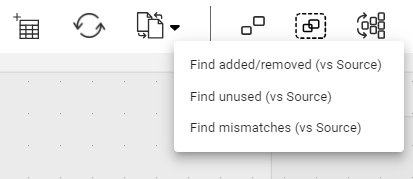
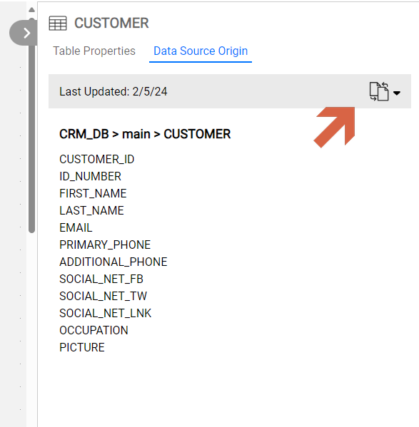

# Tables Reconciliation

Tables Reconciliation allows you to analyze changes made to the connected source data platform tables upon which your project’s tables are based on. It provides a valuable solution for two primary scenarios:

1. Building Project Tables: When constructing project tables based on source data platforms, you may intentionally omit certain columns, selecting only those necessary for your data product’s business entity model. However, at a later stage, you might want to revisit the skipped columns and decide to incorporate them into your project’s table.
2. Project Lifecycle Updates: Throughout the project’s lifecycle, the connected source data platform tables may undergo modifications—such as adding or removing columns. In such cases, you can use Tables Reconciliation to identify discrepancies between the source and project tables, allowing you to take informed actions within the Table Editor.

According to these cases, Tables Reconciliation enables you to easily find mismatches of added, removed and unused columns, within the Table Editor, and take action according to your needs.

> Note: Tables Reconciliation process is relevant only for those tables which were built based on source data platforms, using the DB Explorer, since introducing this feature - Fabric 8.0.

## Activating the Reconciliation Mismatches Finder

You can find mismatches according to either of 3 options: Find only added/removed tables columns which were added or removed at source, unused columns comparing to source, find all mismatches, includes added/removed/unused.

You can trigger the mismatches finder either in schema level or per table:

#### Schema

Activating the mismatches finder at the schema - the main tables design surface - gives you an overview of mismatches of the LU schema's tables, either if such changes are related to each other or not.

1. At the top schema toolbar look for the  Reconciliation action icon. 
2. Click on the icon to activate the mismatches finder, or click on the arrow aside it and choose one of the 3 options.

#### Table

You can activate the mismatches finder on a specific table:

* At the Schema, choose a table and click to open its Properties panel.

* At the project tree, choose the table and open it. Then click to open its Properties panel.

  

1. Switch to the *Data Source Origin* tab.
2. look for the  Reconciliation action icon. You can click on the icon to activate the mismatches finder, or click on the arrow aside it and choose one of the 3 options.

1. As a result, mismatches finding process is starting.
2. Upon mismatches finding process is concluded:  
   - If mismatches were found, then if acticated within schema the relevant tables headers become purple colored.
   - If mismatches were not found a notification message appears at the bottom right side of the window. indicating it.

> Reconciliation Mismatches Finder Notes:
>
> * The mismatch finding process looks either directly at the source data platforms or at the outcome of the Catalog's Discovery, when it being used.
> * When mismatch finding process is activated, the Reconciliation action icon becomes to be orange colored, hinting the user that Reconciliation is  turned on and "active".
>   * When in turned on, you can click on the Reconciliation action icon to turn it off, hiding all the mismatches findings.
> * 

turn off...

how to switch...

### 

## Table Editor - Reconciliation Mode

purple title

Click OK

click Cancel

Go next table

## Reconciliation Actions

For each one of the mismatched columns, you can choose either to take action or to decide about it later, as following:

* **Added** column at source:

  * *Do not Add* the column also to the project's table. 

    According to this decision, Studio will not alert you later that this column exists at the source. You still be able to find it when looking for unused columns.

  * *Add* the column also to the project's table.

  * *Decide Later* weather to add it or not. For example, you might not decide now because you wish to be advised by your team, if this column shall be added and used at project.

* **Removed** column from source:

  * *Preserve* the column, although it was removed from the source. This probably useful for cases where this column is in use at implementation and need to be remained. Note that it is your responsibility from now on to populate its data, because the data will not be retrieved from source. 

    According to this decision, Studio will not alert you later that this column was removed at the source.

  * *Remove* from table and be aligned with the source table.

  * *Decide Later* weather to remove it or not. For example, For example, you might not decide now because you wish to be advised by your team, if this column shall be removed or maybe is still needed.

## Table Properties Source Origin

## Highlighting Mismatched Tables

In case you deal with a big schema, containing with many tables, you can easily find those tables by using the Highlighting option:

1. At the top schema toolbar look for the Highlighting action icon.  

2. Click on the arrow aside and choose the *Mismatches vs Source* option.

   

3. As a result, the relevant tables become highlighted while other are grayed-out

> In case Reconciliation is not activated at the schema then this option is disabled
