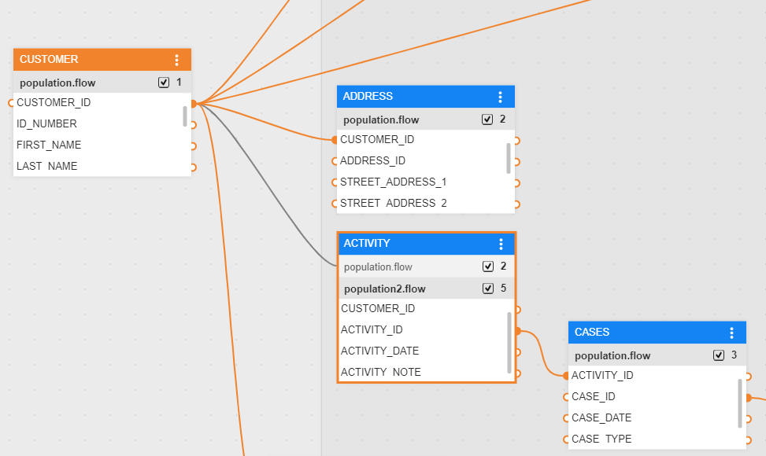

# LU Table Population - Execution Order

Fabric enables setting the execution order of [LU table](/articles/06_LU_tables/01_LU_tables_overview.md) population objects within an [LU schema](/articles/03_logical_units/03_LU_schema_window.md). The execution order is set by a sequence number (1, 2, 3…).

The default order of an LU table’s population is set when the LU schema is created. The default population execution order is based on the LU schema’s hierarchy. However, a different population execution order can be set that supersedes the automatically generated execution order. This could mean, for example, that a table higher in the LU schema’s hierarchy can be populated or modified after a table lower in the LU schema hierarchy has been modified or populated. Therefore, it is imperative to strategize and define the correct execution order of the [LU Table populations](01_table_population_overview.md).

**Parallel Sync Ability**

By default, the populations with the same execution order run sequentially **within the same execution order**.

When linking a population, or changing its parent table order, it will increase all other populations with higher order number, by keeping the same “gaps” between them, Child tables are increased according to the lowest population order of the parent table.

To improve the sync time of an LUI, Fabric can support parallel syncs on several populations within the same execution order. This can be set in config.ini using the parameter **MAX_PARALLEL_SYNC_SAME_ORDER (default value = 1)**. When this parameter is greater than 1, it allows Fabric to run the LU Table Populations with the same execution order in parallel groups (according to the parameter’s value) in order to bring data from the source DB faster. The part of the sync that writes the data into Fabric remains sequential.

### How Do I Set the Population Order?

The LU schema's Root Table is always populated first. By default, its execution order is set to 1. Other tables in the LU schema are populated according to their hierarchy level in the LU schema in a parent plus one order.

By default, all LU table populations on the same hierarchy level in an LU schema have the same execution order. The order can be modified and have different values if needed. For example, when tables T2 and T3 are added to a schema under table T1, the population execution order of tables T2 and T3 will be the same and will be higher than the execution order of table T1.
An LU table may have more than one population. By default, all populations in the same LU table are set to the same population execution order, which can also be updated manually if needed. 

A Root Table can have multiple populations like any other LU table. By default, their execution order is set to 1, which can be updated manually if needed. Note that if Root Table populations have been updated to have different execution order and the population with the minimum execution order doesn't return any IIDs, Fabric doesn't execute other Root Table's populations. 

**Example**

<studio>

The following diagram displays an LU schema with four tables: Customer, Subscriber, Activity and Address.

*	**Customer** is a Root Table. It has one population. Its execution order = 1, indicating that the Customer table will always be populated first in the LU.
*	**Subscriber** and **Activity** tables are on the second level in the LU schema’s hierarchy: 
    *	**Subscriber** table has one population: popSub. 
    *	**Activity** table has two populations: query_CRM_DB_ACTIVITY and pop_Activity_UP. 
    *	The execution order of popSub and query_CRM_DB_ACTIVITY = 2 and the tables will be populated simultaneously.
    *	The execution order of pop_Activity_UP = 5. It is set to a higher value in order to be executed after all other LU tables are populated.
*	**Address** table is **also** on the second level in the LU schema’s hierarchy. It has two populations: popAddressCust and popAddressSub. 
    *	The execution order of the popAddressCust population = 2. It will be executed simultaneously with the popSub and query_CRM_DB_ACTIVITY
    *	Population popAddressSub has execution order = 3. It will be executed after popAddressCust.

</studio>

<web>

The following diagram displays an LU schema with four tables: Customer, Activity, Address and Cases.

*	**Customer** is a Root Table. It has one population. Its execution order = 1, indicating that the Customer table will always be populated first in the LU.
*	**Address** and **Activity** tables are on the second level in the LU schema’s hierarchy: 
  *	**Address** table has one population. **Activity** table has two populations. 
  *	The execution order of the tables default populations is 2, so they will be populated simultaneously.
  *	The execution order of Activity's population2 is 5. It is set to a higher value in order to be executed after all other LU tables are populated.
*	**Cases** table is on the third level in the LU schema’s hierarchy. 
  *	**Cases** table population has execution order = 3. It will be executed after the **Address** and **Activity** tables default populations.

</web>

Note that if **MAX_PARALLEL_SYNC_SAME_ORDER** is set to 1 in config.ini, the above LU table populations whose execution order = 2 will be executed sequentially. However, if **MAX_PARALLEL_SYNC_SAME_ORDER** is set to 3 or higher, all LU table populations will fetch the data from the source DB in parallel and will then populate the target DB sequentially.  

### How Do I Disable and Enable a Population? 
The population in an LU schema can be disabled / enabled according to requirements. For example, if a table population is not required temporarily it can be disabled and be later enabled instead of being deleted. 

Note that at least one population must be enabled in the root table.

[Click for more information about Disabling / Enabling Populations](/articles/03_logical_units/13_disable_enable_populations_in_schema.md).

