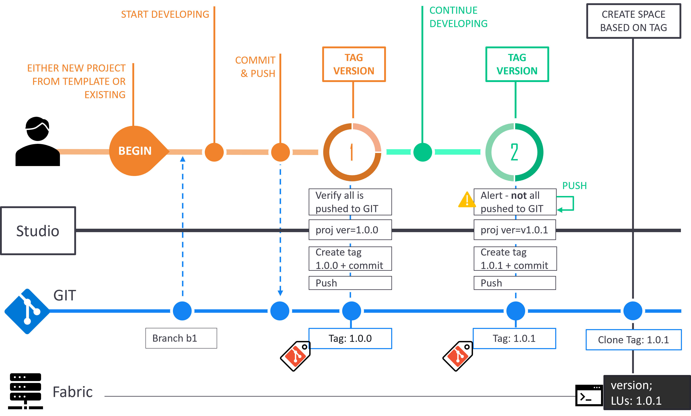

# Project Versioning Examples

Below are several examples for project versioning use cases, accompanied by diagrams that illustrate them, as an end-to-end workflows.

## Example #1: Studio flow - Single Developer 

This example shows a few cases of a developer workflow.

* Create a tag, where all changes are committed and pushed and aligned with GIT.

* Create a tag, where there are local changes that are not pushed to GIT.

  > While this case is a little risky, it is valid, when developer already continued working on next features, before it was decided to set a version. In our example, the developer pushes the leftovers. and activate tag version again, this time without getting any warnings.

<studio> 

* Deploy to remote server where no changes were done after creating the tag. In this case, deployed artifacts are fully aligned with the tag, so that when running the `version` command in the remote server, and see as result the project's version, you have confidence that it is aligned with tag artifacts in GIT.

* Deploy to remote server where changes were done locally after creating the tag. In case where Warn-on-Tag-Diff is chosen in User Preferences for this remote server, Studio warns the user. If the user chooses to proceed anyway, then the built artifacts are marked with a star (*). This way, when running the `version` command in the target remote server, the user is hinted that the deployed artifacts are not fully aligned with the tagged version.

</studio> 

<web>

* Create a space that is based on tag (e.g., use a project space profile that based on that tag). In this case, the project content is cloned to the space according to the tag. When running `version` command on the server, and see as a result the project's version, you have confidence that it is aligned with tag artifacts at GIT.

  

</web>

## Example #2: Studio Flow - Several Developers

This example illustrate the case of several developers who work on the same project. This example starts when version 1.0.4 is created and two developers start working based on it (it is assumed that the branch is fully aligned with the tag. You can see in example 1 that it is not necessarily the case).

* DEV 1 initiates the tag version action. She is warned because DEV 2 made pushes his changes after her, meaning, her code is not fully aligned with the branch. In our example - she proceeds with the process.

  >  This is a legitimate case, where another developer continues with implementation that aimed for a later version. Accordingly, DEV 2 might verify, before proceeding, that DEV 2 changes shall not be part of the version content.

* DEV 2 initiates the tag version act. He will be rejected because the candidate version is the same as DEV1 (1.0.5), who already created it. This will happen as long as he did not pull DEV1 changes from GIT, also with the updated tag version, and as long as he did not change the auto proposed version.

## Example #3: Hotfix

This example illustrates a case that hotfix is required, where one of the developers handles it, while another continues to work on the main branch, without collisions.

* DEV2 assigned to make hotfix and switch to work based on tag (by doing it he detached from tag and need to make his changes on a some branch).
* When DEV2 initiates the Tag Version action, Studio suggests him as next version - 1.0.1, which comes after current version - 1.0.0.  DEV 2 overrides this value with HF version ("1.0.0-HF1").
* DEV1 works on the on going branch and thus no conflicts will appear when pushing her stuff into GIT, as well when initiating tag version, which suggested to be, as expected, 1.0.1.

