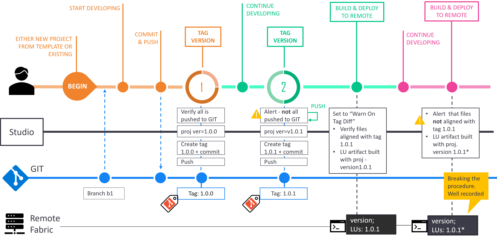
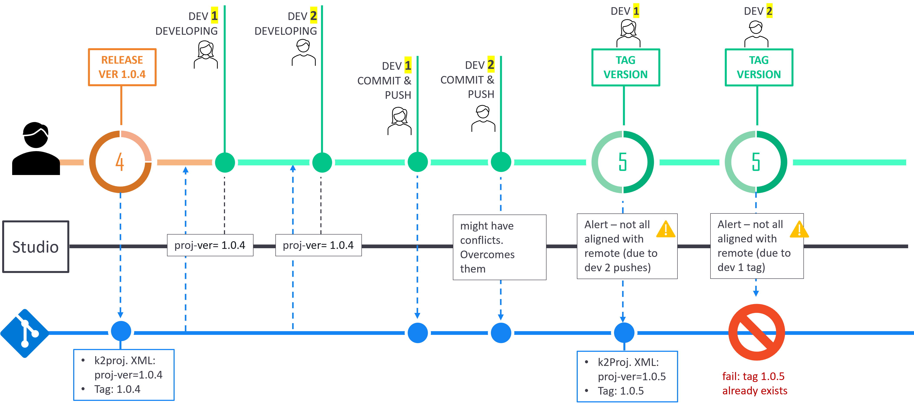
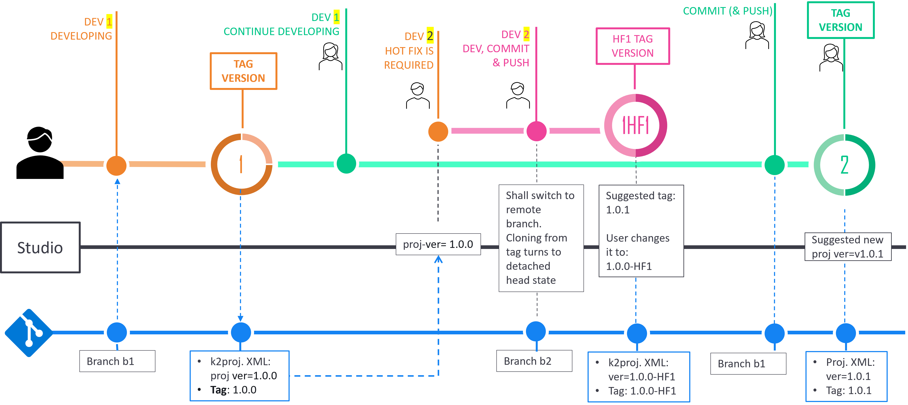

# Project Versioning Examples

Below are several examples for project versioning use cases, accompanied by diagrams that illustrate them, as an end-to-end workflows.

## Example #1: Studio flow - Single Developer 

This example shows a few cases of a developer workflow.

* Create a tag, where all changes are committed and pushed and aligned with GIT.

* Create a tag, where there are local changes that are not pushed to GIT. Studio, then, alerts about their presence.

  However, the developer can also choose to ignore the alert and to continue with the version tagging. This is a slightly risky, yet a valid case, as the version that is about to be released should not include the features he is currently working on. In our example (depicted in the below diagram), the developer pushes his changes and re-activates the version tagging, this time without getting any alerts.

<studio> 

* Deploy to remote server where no changes were done after creating the tag. In this case, the deployed artifacts are fully aligned with the tag, in a way that when running the `version` command in the remote server, you can be assured that the version is aligned with tag artifacts.

* Deploy to remote server where changes were done locally after creating the tag. In case where Warn-on-Tag-Diff is chosen in User Preferences for this remote server, Studio alerts the user. If the user chooses to proceed anyway, then the built artifacts are marked with a star (*). This way, when running the `version` command in the target remote server, the user is hinted that the deployed artifacts are not fully aligned with the tagged version.

</studio> 

<web>

* Create a space that is based on a tag (e.g., use a project space profile that is based on that tag). In this case, the project content is cloned to the space according to the tag. When running `version` command on the server, you can be assured that it is aligned with tag artifacts in GIT.

  

</web>

## Example #2: Studio Flow - Several Developers

This example illustrates the case of several developers who work on the same project. This example starts when version 1.0.4 is created and two developers start working based on it (it is assumed that the branch is fully aligned with the tag. You can see in example 1 that it is not necessarily the case).

* DEV 1 initiates the tag version act. She is being alerted because DEV 2 has pushed his changes after she did, meaning, her code is not fully aligned with the branch. In our example - she proceeds with the process.

  >  This is a legitimate case, where another developer continues with an implementation that is aimed for a later version. Accordingly, DEV 1 should verify, before proceeding, that DEV 2's changes shall not be part of the current version content.

* DEV 2 initiates the tag version act. He will be rejected because the candidate version is the same as DEV 1 (1.0.5), who already created it. This will happen as long as he did not pull DEV 1 changes from GIT, also with the updated tag version, and as long as he did not change the auto proposed version.

## Example #3: Hotfix

This example illustrates a case that hotfix is required, where one of the developers handles it, while another continues to work on the main branch, without collisions.

* DEV 2 assigned to make a hotfix and switch to work based on tag (by doing it he detached from tag and needs to make his changes on a some branch).
* When DEV 2 initiates the Tag Version action, Studio offers him the next version - 1.0.1, which is the next consecutive version that follows the current version - 1.0.0. DEV 2 overrides this value with HF version ("1.0.0-HF1").
* DEV 1 works on the ongoing branch and thus no conflicts will appear when pushing her stuff into GIT, as well when initiating tag version, which suggested to be, as expected, 1.0.1.

