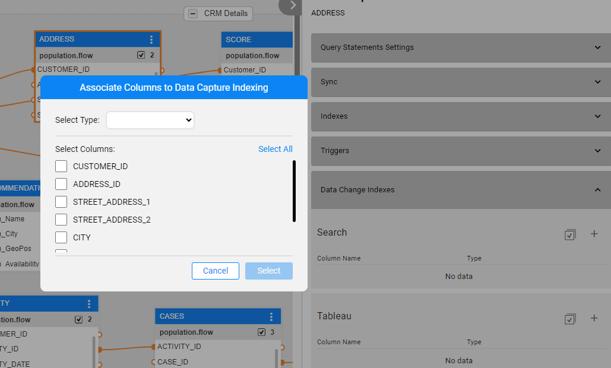

# CDC Implementation Steps

## Adding CDC Consumers

Fabric has a built-in integration with Elasticsearch and it can also send CDC changes to other consumers. 

The Fabric Studio can be customized. Consumers can be added to CDC fields by editing the [project name].k2proj file of a Fabric project:


1. Right-click the project name and select **Open Folder**.

2. Open the [project name].k2proj file to be edited.

3. Edit the **DataChangeIndicators** element by adding the **DataChange** element. Set the consumer name in the *DataChange name* attribute and set the available types for the CDC columns in the **Option**/**s** elements.

   By default, the **DataChangeIndicators** contains the **Search** consumer. View the below example:

   ```
    <DataChangeIndicators>
       <DataChange name="Search" enabled="true">
         <Options>
           <option>keyword</option>
           <option>data</option>
           <option>date</option>
         </Options>
       </DataChange>
   	<DataChange name="Tableau" enabled="true">
         <Options>
           <option>keyField</option>
           <option>dataField</option>
         </Options>
       </DataChange>
     </DataChangeIndicators>
   ```

   Note that the name '**Search**' is a reserved name, as it is a reserved word within the **Elasticsearch** engine, and it should be neither altered nor used for additional data change consumers.

   

4. Save the .k2proj file.

   <studio>

5. Close your project, and reopen it in order to reload the changes done in the .k2proj file.

6. Open the required LU table and set the new consumer column. A new tab is added for each new data change consumer defined in the .k2proj file: 

   

   

   The name of the Kafka topic added for the new CDC consumer is identical to the name of the new tab. 
   Note that Fabric concatenates the [cluster id](/articles/02_fabric_architecture/05_fabric_main_configuration_files.md#nodeid) to each topic name if there are several Fabric clusters on one Cassandra cluster.

   </studio>

   <web>

   5. Open the required LU table properties, on the right pane of the schema window - when a table is selected, or in the table's window. 

   6. Expand the Data Change Indexes section, where the added CDC consumer will be shown as a new subsection.

      

   </web>

### Creating Indexes for Other CDC Consumers

When defining an LU in the Fabric Studio, selected tables and columns can be set to publish CDC messages each time they are updated. 
For example, to notify an external consumer system about a customer's change of address, the following columns are defined as CDC columns in the ADDRESS table in the CUSTOMER LU: STATE, CITY, STREET, HOUSE_NO, ZIP_CODE.

<web>

You can add either column by column to the list, by clicking on the `+` action button, or all columns at once, by clicking on Select all  action button. When this button is clicked, a pop-up window opens, where you can either choose multiple columns or click to select all, as well as set the columns' type (selecting from the drop-down list).



</web>

Note that Fabric Studio does not enable defining more than 63 columns as CDC fields in the same LU table, assuming that all columns are positioned according to 1-63 in the LU table. This limitation is not valid from Fabric release 6.5.4 and onwards.

A specific [CDC message](03_cdc_messages.md) is generated for each type of change in the CDC column. 


[](04_cdc_publication_flow.md)[](06_cdc_configuration.md)
