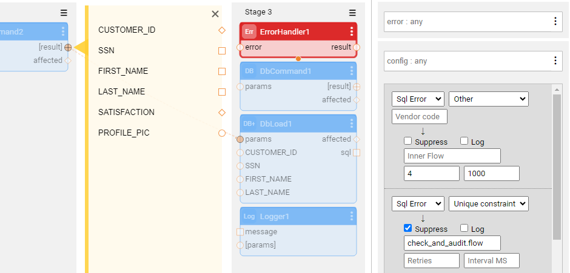

# Error Handling Actors

Broadway has a built-in error handling mechanism that handles exceptions in a flow using **Error Handlers**. An error handler is defined using a Broadway Actor. Any Actor or [Inner flow](/articles/19_Broadway/22_broadway_flow_inner_flows.md) can act as an error handler. 

This article describes the **ErrorHandler** and **ErrorFields** Actors which are dedicated for error handling.

For information about the error handling mechanism of Broadway, refer to the [Error Handling](/articles/19_Broadway/24_error_handling.md) article.

### How Do I Use the ErrorHandler Actor?

The **ErrorHandler** Actor can be used as an error handler to enable different handling of various exceptions. It can be configured to suppress one type of exception and not to suppress others, or to invoke an inner flow when an exception is thrown. When the error is suppressed, the **ErrorHandler** returns **true** and the flow continues. When the inner flow is invoked, the **error** object is passed to it and it includes all the exception details, such as the error code and message, the flow, Stage and the Actor where the error occurred.

The exceptions are classified into three types: SQL error, HTTP error and exception. The SQL errors are divided into Unique constraint or other. Note that the Unique constraint exception validation is only done for Oracle, DB2, SQLite and SQL servers. 

The following example shows how an **ErrorHandler** Actor is used as an error handler in the **LU Table** Stage. In the following configuration only **Unique Constraint** SQL errors are caught and suppressed. Any other error causes the flow to fail. 

The following example shows how different types of errors are handled whereby error handling is performed according to the order of the Actor's execution.

* On the **Unique Constraint** SQL error, suppress the exception.
* On any other exception, do not suppress the exception and invoke the **errorHndlFlow** [Inner Flow](../22_broadway_flow_inner_flows.md).

### How Do I Use the ErrorFields Actor?

The **ErrorFields** Actor can be used to get detailed information about an exception. The Actor can be used either as an error handler or as a regular Actor in an inner flow to access error information. The **ErrorFields** Actor always suppresses exceptions. 

When the **ErrorFields** Actor is used in an inner flow that is invoked from the **ErrorHandler** Actor, the **error** input argument must be defined as External. Then the error details are automatically passed from the calling flow.

### Retry Using Error Handling Actors

Starting from V8.0, the **ErrorHandler** Actor supports the retry mechanism. The Retry is configured using the **Retries** and **Interval** fields. The fields' default values are 0 and 500 msec. 

If any actor of the stage with an ErrorHandler fails and the retry fields are set, the actor will be executed again. 

If the Inner Flow is defined in the ErrorHandler's editor, the Retry logic is taken from the flow and not from the actor's fields. 

Retry can be defined for selected exception types only. When several different exception types are configured on the same ErrorHandler, each with a different retry - each exception type will trigger its own retry counter. 

When the retry is implemented by an **inner flow** rather than by the **ErrorHandler** Actor, the **ErrorFields** Actor should be used in this inner flow to check the number of attempts that have already been executed - using the **attempt** output parameter.

