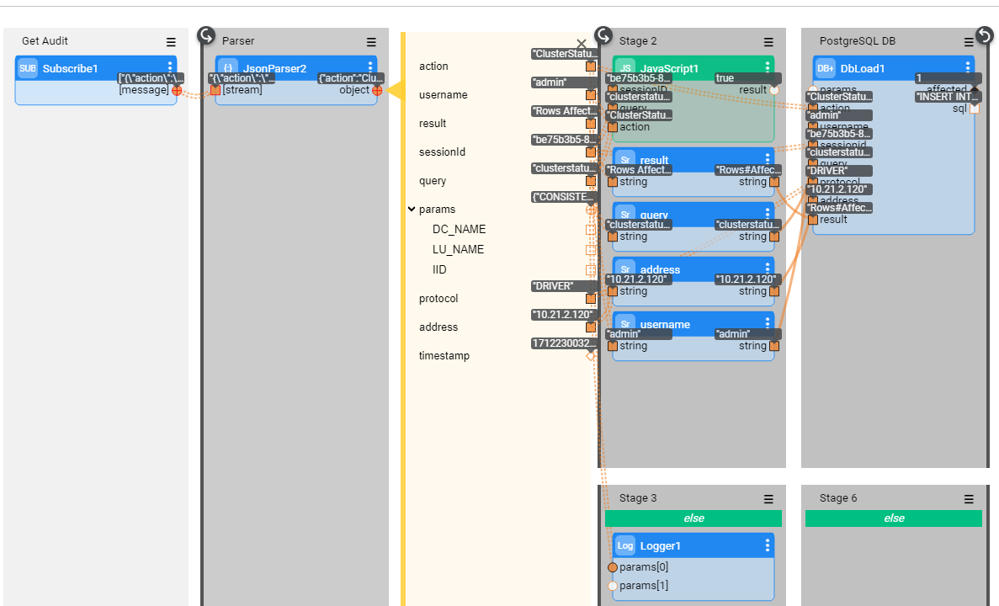

<studio>

# Persistence Strategy

The persistence of the data published by the Auditing mechanism can be controlled. Product provides two persistence strategies:

* **com.k2view.fabric.auditing.persistence.SystemDbBeanPersistence** (default) - The data is written to **k2_auditing** table in the metadata keyspace (k2audit by default). 
* **com.k2view.fabric.auditing.persistence.KafkaBeanPersistence** - Kafka persistence strategy. The audit data is written to **k2audit** default topic.

Persistence strategy is defined in the **config.ini** using the AUDIT_PERSISTENCE_STRATEGY parameter, which by default, is set to **com.k2view.fabric.auditing.persistence.SystemDbBeanPersistence**.

In addition to the above product strategies, a new strategy can be defined by creating your own class. The steps on how to do it are explained further on in this article.

### How Can I Set The Persistence Strategy to Kafka?

In order to switch the persistence strategy to Kafka, do the following:

1. Update the  **AUDIT_PERSISTENCY_STRATEGY** parameter in the **config.ini** file to: 

   ~~~
   AUDIT_PERSISTENCE_STRATEGY = com.k2view.fabric.auditing.persistence.KafkaBeanPersistence
   ~~~

2. Verify that AUDIT is set to ON in the **config.ini** file.

   ~~~
   AUDIT=ON
   ~~~

3. Configure the Kafka producer using the relevant parameters in the **[audit_kafka_producer]** section of the **config.ini** file.

4. Restart the Fabric node.

#### Example - Logging Audit to PostgreSQL via Kafka

When you have a requirement to make the audit records available to another channel, the persistence strategy should be changed from the System DB to Kafka. 

For example, when you need to log the Audit records into some relational DB (e.g. PostgreSQL), you can publish them to Kafka. To do so, update the **AUDIT_PERSISTENCE_STRATEGY** parameter in the **config.ini** to **com.k2view.fabric.auditing.persistence.SystemDbBeanPersistence** and restart the Fabric node as explained above.

Then, create a Broadway flow that will consume the Kafka messages and load them into your required target DB. 

The below Broadway flow consumes the Audit messages from Kafka topic and loads them into the target PostgreSQL DB.

The Kafka message looks as follows:

~~~json
{
	"action": "GetCommand",
	"username": "admin",
	"result": "LU type 'OracleLu' not found. Please deploy it using K2view Fabric Studio",
	"sessionId": "264adf99",
	"query": "get OracleLu.5 ",
	"params": {
		"DC_NAME": "null",
		"LU_NAME": "OracleLu",
		"IID": "5"
	},
	"protocol": "DRIVER",
	"address": "127.0.0.1"
}
~~~

### How Can I Define A New Persistence Strategy?

In order to define a new persistency strategy, create your own persistency strategy class. Alternatively, you can start from the sample class **com.k2view.external.fabric.audit.persistencies.SamplePersist** provided as part of the Fabric installation and modify it according to your needs. 

In case of your own class, it must be created under the **com.k2view.external.fabric.audit.persistencies** folder and it should implement the **com.k2view.external.fabric.audit.filters.AuditBeanPersistence** interface. 

Build artifacts by doing the same steps as described [in the Filtering Strategy article](02_filtering_strategy.md). Then, do the following:

1. Update the **config.ini** file with the full path of the class in the  **AUDIT_PERSISTENCE_STRATEGY** parameter. For example:

   ~~~
   AUDIT_PERSISTENCE_STRATEGY = com.k2view.external.fabric.audit.persistencies.SamplePersist
   ~~~

2. Verify that AUDIT is set to ON in the **config.ini** file.

   ~~~
   AUDIT=ON
   ~~~

3. Restart the Fabric node.

#### Example - Setting New Persistence Strategy

The following example displays the persistency class **com.k2view.external.fabric.audit.persistencies.SamplePersist** which writes the Audit operations into a file.

~~~java
package com.k2view.external.fabric.audit.persistencies;

import com.k2view.fabric.common.Log;
import com.k2view.fabric.auditing.AuditBean;
import com.k2view.fabric.auditing.persistence.AuditBeanPersistence;

import java.io.BufferedWriter;
import java.io.FileWriter;
import java.util.Date;

public class SamplePersist implements AuditBeanPersistence {
    @Override
    public void persist(AuditBean auditBean) throws Exception {
        /*
         * Here you should add your way of how to persist the bean
         */
        Date d = new Date();
        
        String fileName="/home/k2view/AuditFiles/AuditFile.txt";
        
        BufferedWriter writer = new BufferedWriter(new FileWriter(fileName, true));
        writer.write("Bean {} will not be persisted  "+ auditBean.toString());
        writer.flush();
        writer.close();
        Log.a(SamplePersist.class).info("Bean {} will not be persisted", auditBean.toString());
    }
}

~~~

</studio>
