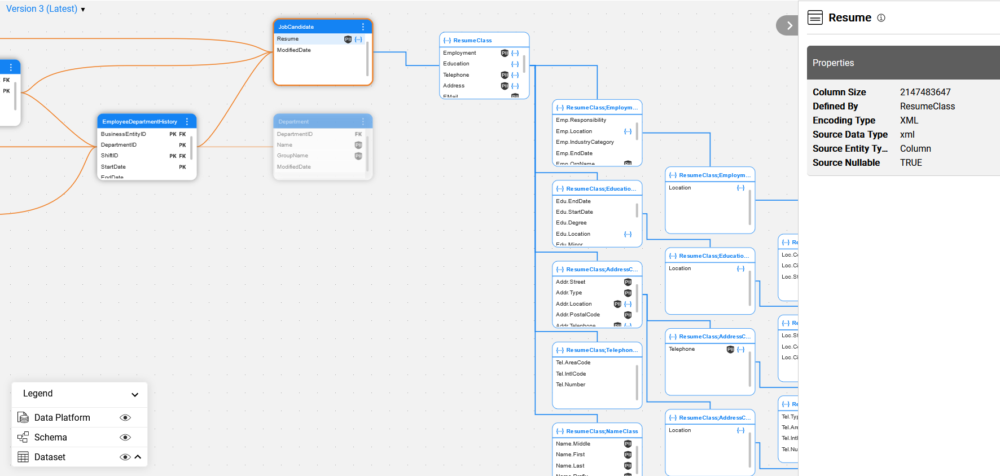

# Complex Field Parsing

Starting from V8.0, Fabric's Catalog supports parsing of text fields that include complex structures (JSON or XML). This is done using a **Complex Field Parser** plugin, which uses the data snapshot taken from the source. When the plugin identifies a complex structure embedded into a field, a **Class** node is created for each complex field's level, recursively, for all levels of this embedded complex structure. The parsing logic is as follows:

* If the same field includes different complex structures within the data snapshot, these structures are combined as the fields of the same class.
* If the same field includes structures (e.g., JSON) and regular strings, the parsing is not performed.

A **definedBy** relation type is created to connect between a complex field and its respective class. This relation cannot be added or deleted in an Edit mode. 

Once the complex field is parsed and the class nodes are created, it undergoes the auto-profiling using the same profiling rules as all other Catalog fields. 

The profiling is performed by the **Data Regex Classifier** and **Metadata Regex Classifier** plugins that create the Classification property for the fields of newly created classes. The **Classification PII Marker** plugin then creates the PII property where applicable. When at least one of the fields of the complex field is marked as PII, the complex field itself is marked as PII.

 
