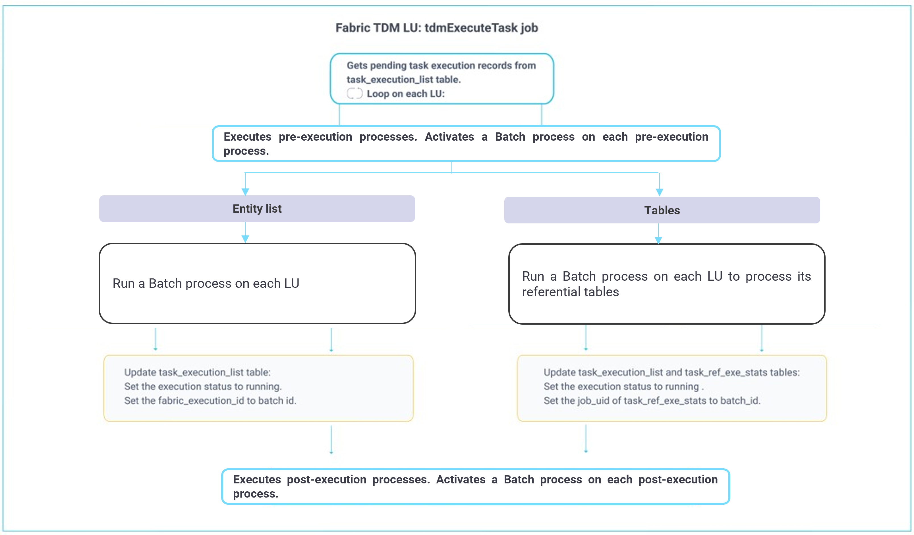

# Task Execution Processes

This article describes the task execution's steps and the TDM processes of each step.

The Task Execution process consists of the following steps:

1. Creating a task execution request.
2. Initiating a Batch process on each task's LU and implementing post-execution processes in an asynchronous mode.
3. Updating the status of the completed processes.

A [Task Execution process](/articles/TDM/tdm_gui/26_task_execution.md) can be initiated either from the TDM Portal, a direct call to the [start task execution API](/articles/TDM/tdm_gui/TDM_Task_Execution_Flows_APIs/04_execute_task_API.md), or via a [TDM Scheduling](/articles/TDM/tdm_gui/22_task_execution_timing_tab.md) process.  

A task can include Entities and/or Reference tables, both of which can have post-execution processes. For example, sending an email to a user after a task has been executed.

The following diagram displays the task execution process:

## Main TDM Task Execution Process: tdmExecuteTask Job

This job runs every 10 seconds and scans the [task_execution_list](02_tdm_database.md#task_execution_list) in the TDM DB table to get pending task execution requests.

Each task execution gets a unique **task_execution_id** identifier. A task execution may include several LUs and post-execution processes, each with a separate record in the task_execution_list. All records related to a given task execution have the same **task_execution_id**. 

The task execution order of the related task's components is as follows:

1. Runs the LUs (from parent to child). It processes all related entities on each LU before moving to the child LU's execution. Click for more information about the [execution order of the hierarchical LUs](/articles/TDM/tdm_overview/03_business_entity_overview.md#task-execution-of-hierarchical-business-entities).

2. Runs the post-execution processes after the execution of the LUs ends. Post-execution processes are executed according to their [execution order](/articles/TDM/tdm_gui/04_tdm_gui_business_entity_window.md#post-execution-processes-tab) as defined in the task's BE. 

The following diagram describes the main TDM Task Execution process:

The execution is implemented in an asynchronous mode. The **tdmExecuteTask** job starts the execution on each LU or post-execution process and a separate TDM job - **checkMigrateAndUpdateTDMDB** - checks and updates the execution status of each process.

Both jobs must be executed in parallel. 

**Example:**

1. Execution of a task with **Customer** and **Billing LUs** and with a post-execution process that sends an email when the task execution ends. The Customer is the parent LU of Billing. 
2. Three records are created in the task_execution_list on this task; all have the same task_execution_id.
3. The **tdmExecuteTask** job executes the Batch process on the **Customer LU**. 
4. The **checkMigrateAndUpdateTDMDB** job updates the status of **Customer LU** when the execution is completed.
5. The **tdmExecuteTask** job starts executing **Billing LU** since **Customer**, its parent LU, is marked as completed.
6. The **checkMigrateAndUpdateTDMDB** job updates the status of **Billing LU** when the execution is completed.
7. The **tdmExecuteTask** job can start executing the **post-execution process** after the execution of all the task's LUs.

## checkMigrateAndUpdateTDMDB Job

This job runs every 10 seconds and checks the execution status of the running process. It selects records from the **task_execution_list** in the TDM DB table where the execution_status is **running**.

The execution status is checked as follows:

1. Checks the execution status or all related Reference tables in [task_exe_ref_stats](02_tdm_database.md#task_ref_exe_stats) in the TDM DB table.
2. Checks the batch status based on the **batch_id** populated in **task_execution_list.fabric_execution_id** column by the tdmExecuteTask job. 

When the process is completed, the following TDM DB tables are updated:

- **task_execution_list**, update the execution_status and additional data.
- [task_execution_entities](02_tdm_database.md#task_execution_entities), populate each entity or Reference table and its status. Set the **id_type** to **ENTITY** or **REFERENCE** according to the entity or Reference table data type.
- [task_exe_error_detailed](02_tdm_database.md#task_exe_error_detailed), populate the execution errors in Extract tasks. Note that the execution errors of Load tasks are reported to this table by the **PopulateTableErrors** Actor.

A new Global has been added in TDM 8.1: **TDM_BATCH_LIMIT**. This Global enables to limit the number of entities to be populated into the TDM execution tables per task execution. From Fabric 7.2 onwards, it is possible to populate the **LIMIT** parameter of the [batch_details command](/articles/20_jobs_and_batch_services/12_batch_sync_commands.md#batch_details-batch_id-statusstatus-entitiesentity-1entity-2-affinityaffinity-limitlimit-sort_by_process_timetruefalse) with -1 to get all batch's entities without a limit. Therefore, the TDM_BATCH_LIMIT Global is set by -1 by default, allowing to get all the batch's entities and populate them into the TDM DB during the task execution.

### Handling Completed Task Executions

The task execution is completed when it does not have pending or running executions. The **checkMigrateAndUpdateTDMDB** job handles completed task executions as follows:

1. It updates the execution summary in the TDM DB tables.
2. It synchronizes the task execution details to Fabric. 

#### Updating Execution Summary TDM Tables

Updates the following TDM DB table:

- [task_execution_summary](02_tdm_database.md#task_execution_summary)

#### Sync the Task Execution ID to TDM LU

The TDM LU holds the execution details of each task execution. The TDM's **instance ID** is the **task_execution_id** generated for each task execution.

The completed task execution is synchronized into the TDM LU. The execution information and the TDM execution reports are extracted from the TDM LUI data.

