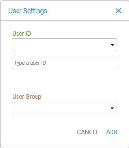

# Environment Window - General Information

The General Information section in the Environment Window holds the following information:  

## Environment Name

Mandatory setting.

Populate the following settings:

- **TDM Environment Name** - select the environments deployed to Fabric from the drop-down list. 

## Environment - Additional Information

Optional settings:

- Description
- Contact person setting

## Environment Type

Mandatory setting. 

Set the environment type to one of the following:

- **Source** - this can only be defined as a source environment in a TDM task. For example, in a Production environment a TDM task can extract entities but cannot insert entities.

- **Target** - this environment can only be used as a target environment in a TDM task.

- **Both** - this environment can be used as both a source and a target environment in the TDM task. This mode is useful for [Data Versioning tasks](15_data_flux_task.md). 

Example:

- A tester backs up data in a testing environment before running functional tests by creating and executing an [Extract Data Versioning task](16_extract_task.md#data-versioning) on the testing environment. The testing environment is set as a source environment. During the execution of the Extract task, data is saved in the TDM Fabric repository.
- During functional tests the data in the testing environment becomes corrupted and needs to be replaced with the last backed up version created in the testing environment. The tester creates a [Load Data Versioning task](18_load_task_data_versioning_mode.md) and sets the testing environment to be both source and target. 

## Override Sync Mode

Optional setting. 

Override mode can be set if the **Environment Type** is **Source** or **Both**. This setting overrides the default Fabric [Sync mode](/articles/14_sync_LU_instance/02_sync_modes.md) when extracting the selected entities from the source environment and sets another Sync mode that can be overridden on both the environment and the task levels.

The following values can be set in Override Sync Mode settings:

### Do not Sync 

Do not sync the entities from the source when running a TDM task with the environment as a source, instead get the entities from Fabric. Note that if the entities do not exist in Fabric, the task's execution will return an error. This mode is needed when access to the source environment has been limited by the organization.

Example:

- The Production team allocates a predefined window to extract a subset of entities from Production. Access to Production is restricted to the predefined window.
- An [Extract task](16_extract_task.md) must be created and run to extract a large subset of entities from Production and to migrate them into Fabric. The **Override Sync Mode** in the **Production** TDM environment must be set to **Do not Sync** to avoid additional access to Production. Other TDM tasks in the Production source environment get data entities from Fabric. 

### Always Sync  

Always sync the entities from the source when running a TDM task with the environment as a source. 

Click for more information on [how overriding the sync mode impacts the task execution](/articles/TDM/tdm_architecture/04_task_execution_overridden_parameters.md#overriding-the-sync-mode-on-the-task-execution) process.

## Mask Sensitive Data

TDM 8.1 added this checkbox. This checkbox is displayed on any environment that can be used as a source environment (the environment type is Source or Both) and that indicates whether the environment contains sensitive data that must be masked before it is saved into Fabric. This checkbox has been added to the Task window as well and is populated based on the task's source environment. The user can add masking on the task (by checking the clear checkbox) even if the task's source environment is not defined with sensitive data. However, the user is not allowed to remove the masking if the task's source environment has sensitive data (the environment's *Mask Sensitive Data* checkbox is checked).

## Environment Owners

- Admin users can add or remove one or several environment owner users or user groups (Fabric roles) to/from an environment. An environment owner user or group can be added to several environments.
- Adding a user group to the environment enables the users that belong to the group to be the owners of the environment.
- An environment owner user or group can be attached to an environment with tester permissions. For example, a user is attached to ENV1 as the environment owner and is attached to ENV2 as a tester.
- The environment owner can edit an environment except for adding or removing environment owner users. Only Admin users can add or remove environment owners.
- The environment owner can create and execute TDM tasks on their environment without limitations, unlike tester users who can define a task on an environment based on their permissions.

Click for more information about [environment permissions](10_environment_roles_tab.md).

Click for more information about the [Owner TDM Permission Group](02_tdm_gui_user_types.md#owner).

### How Do I Add or Remove Environment Owners to/from an Environment? 

#### Adding Environment Owners

- Click the plus icon next to the Environment Owners setting. 

  

  

- A pop-up window opens:

#### Deleting Environment Owners

Click the X on an environment owner/s username to remove that username from the environment:

Note: Always click **Save Changes** after editing the General Information section in the Environment window.

  

