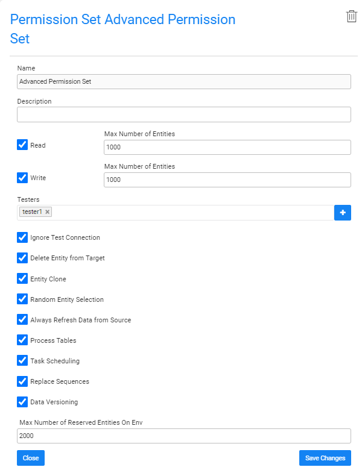
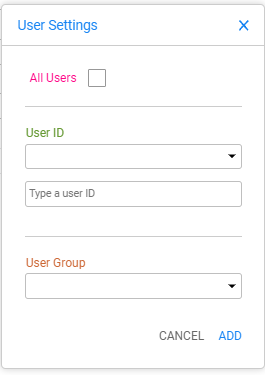

# Environment Permission Sets Tab

TDM Environment permission sets are set on an environment level and are assigned to testers. Each permission set defines a list of permissions related to the creation and execution of TDM tasks in an environment. Testers can only create and execute a TDM task if they are assigned to one of the environment's permission sets. 

A TDM Environment permission set is an **optional setting** in an environment and it can be created, edited or deleted by either an Admin user or the [Environment Owner](08_environment_window_general_information.md#environment-owners). An environment without a permission set or without testers attached to a permission set, can only be used by Admin users or by Environment Owners.

An environment's permission sets are displayed in the **Permission Sets tab** in the Environment window:

- To create a new permission set , click **New Permission Set**, populate the permission set's settings and then click **Add**.
- To open a permission set, click the **Name** of the permission set and then click **Save Changes**. 
- To delete a permission set, click the  icon, located at the upper-right corner of the window.

## Permission Set Window 

The Permission Set window defines the TDM Environment permissions, and the list of testers assigned to it is displayed in the following example:

The Permission Set window has the following settings:

### Name

The name of the TDM Environment permission set (mandatory). Note that each active permission set should be assigned with a specified name. An error is displayed when an attempt is made to create several permission sets with the same name.

### **Description**

A description of the TDM Environment permission set (optional).

### Read and Write and Number of Entities

- Read access can be granted on a source environment, i.e., the [environment type](08_environment_window_general_information.md#environment-type) is **Source** or **Both**. 

- Write access can be granted on a target environment, i.e., the environment type is **Target** or **Both**.

When an Environment Type is Both, it can have both accesses: read and write. Therefore, the TDM Environment permission sets in these environments can have one or both accesses.

  **Example:**

  - ENV1 can be a source or target environment. The environment has 2 permission sets: 
    - Set1, enables read-only access. Testers with this permission set can select this environment only as a source environment in a TDM task.
    - Set2, enables write-only access. Testers with this permission set can select this environment only as a target environment in a TDM task.
    - Set3, enables read and write accesses. Testers with this permission set can select this environment as a source and/or target environment in a TDM task.

- The **Max Number of Entities** field indicates the maximum number of entities processed by a task. This number must be set for each access type. The Number of Entities is set on both **Read** and **Write** access types. A different number of entities can be set for each access type.

  **Example:**
  - Read Number of Entities = 1000. Write Number of Entities = 10. 
  - The user attached to this permission set can run the following tasks on this environment:
    - Select the environment as a source environment and create a task on up to 1000 entities.
    - Select the environment as a target environment and create a task on up to 10 entities.

  Click for more information about [setting the number of entities on a TDM load task](17_load_task_regular_mode.md#requested-entities-tab). 

### Testers

- Attach testers to the TDM Environment permission set. The connection of a tester to a testing environment is established by connecting the tester to the environment's permission set.  

- A TDM Environment's permission set can be attached to selected testers, selected user groups (Fabric roles), or to all TDM users.

Note that although an environment's permission set without tester users is not usable, the **Testers** setting is optional and it enables creating permission sets and then adding them to testers at a later stage.

#### Adding all TDM Users to the TDM Environment Permission Set

The **All** option is used to enable the permission set for all TDM users. To do so, click **Testers** and then select **ALL**.

Alternatively, click the  icon next to the Testers setting. The following pop-up window displays:

Check the **All Users** checkbox.

#### Adding Selected TDM Users to the TDM Environment Permission Set

1. Click **Testers** and select one of the displayed user IDs.
2. Alternatively, click the  icon to open the **User Settings** pop-up window. Select a user ID or manually type it. 
3. Click the ADD button.
4. Click **Testers** again and select another user, or manually type a user name, if needed.

#### Adding Selected TDM User Groups to the TDM Environment Permission Set

1. Click the  icon and to open the **User Settings** pop-up window. Select a user group from the list.
2. Click the ADD button.
3. Click again the  icon next to the **Testers** and select another user group, if needed.

#### TDM Environment Permission Set Assignments Priorities

1. First priority: Assign a user ID to the TDM environment permission set.
2. Second priority: Assign a user group to the TDM environment permission set. All the group's users can work with the TDM environment based on the permissions of the TDM environment permission set assigned to their group.
3. Third priority: Assign a genertic permission set for all users as a default permission set. A user is assigned to the TDM environment with the **ALL** permission set only if the user or their group is not specifically attached to another TDM environment permission set of the environment.

**Notes**

- A tester user can be attached to only one TDM Environment permission set per environment and cannot be attached to different TDM Environment permission sets in the same environment.

- An owner user or group can be attached to either the Environment Owners or the TDM environment permission sets. In other words, an owner tester can be attached to a TDM environment as either an owner user or a tester user.

  

### Permissions

A list of permissions that can be assigned to a permission set. Check to grant one or more permissions to a permission set, as follows:

##### **Ignore Test Connection**  

TDM tests the connections of the source and target environments at the beginning of the task's execution. If the connection fails, the user is asked whether to ignore the failure and continue the execution or to stop the execution. When unchecked, the task's execution stops when the connection fails without an option to ignore the failure and to continue the execution.

##### **Delete Entity from Target** 

Enables the user to check the Delete [task action](14_task_overview.md#task-actions-types) on the task. This permission applies only when the permission set has **Write** access.

##### Entity Clone 

[Create replicas](17_load_task_regular_mode.md#entity-clone-synthetic) of a real entity in a testing environment using a TDM Load task. This permission applies only when the permission set has **Write** access.  

##### Random Entity Selection

[Randomly select entities](17_load_task_regular_mode.md#random-selection) for TDM load task. This permission applies only when the permission set has **Write** access.

##### Refresh All Data from Source

Ask to sync the entities from the source when executing [extract](16_extract_task.md#request-parameters) or [load](19_load_task_request_parameters_regular_mode.md#override-sync-mode) tasks. 

##### Refresh Reference Data

Create TDM tasks to extract or load [Reference tables](24_task_reference_tab.md).

#####  Task Scheduling 

Add [scheduling settings](22_task_execution_timing_tab.md) in the TDM task to run a periodic automatic execution  of the task based on the scheduling parameters.

##### Replace Sequences

[Replace the sequences](/articles/TDM/tdm_implementation/11_tdm_implementation_using_generic_flows.md#step-4---create-the-sequence-creation-flows) of the entities when loading them to the target environment. This permission applies only when the permission set has **Write** access.

##### Data Versioning 

Create [Data Versioning](15_data_flux_task.md) tasks.

#### Max Number of Reserved Entities on Env

The maximum number of entities that the user can [reserve on the environment](/articles/TDM/tdm_architecture/08_entity_reservation.md). From TDM 8.1 onwards, it is possible to add a **Reserve only permission** to the user, i.e., the number of entities in the Write or Read is zero, but the Max Number of Reserved Entities on Env is greater than zero. This permission set allows the user to reserve entities on the environment although they are not permitted to read or write on the environment.

## Environment Permissions Summary Table

<table width="900pxl">
<tbody>
<tr>
<td style="width: 103px;" width="100"><strong>Environment type</strong></td>
<td style="width: 121px;" width="121"><strong>Write permission</strong></td>
<td style="width: 163px;" width="169"><strong>Write - number of entities</strong></td>
<td style="width: 138px;" width="139"><strong>Read permission</strong></td>
<td style="width: 180px;" width="187"><strong>Read -&nbsp; number of entities</strong></td>
<td style="width: 182px;" width="189"><strong>Number of reserved entities&nbsp;</strong></td>
<td style="width: 249px;" width="250"><strong>Permitted activities</strong></td>
</tr>
<tr>
<td style="width: 103px;">Target</td>
<td style="width: 121px;">Y</td>
<td style="width: 163px;">&gt; 0</td>
<td style="width: 138px;">N/A</td>
<td style="width: 180px;">N/A</td>
<td style="width: 182px;">0</td>
<td style="width: 249px;">
<ul>
<li>Load</li>
</ul>
</td>
</tr>
<tr>
<td style="width: 103px;">Target</td>
<td style="width: 121px;">Y</td>
<td style="width: 163px;">&gt; 0&nbsp;</td>
<td style="width: 138px;">N/A</td>
<td style="width: 180px;">N/A</td>
<td style="width: 182px;">&gt; 0</td>
<td style="width: 249px;">
<ul>
<li>Load</li>
<li>Reserve</li>
</ul>
</td>
</tr>
<tr>
<td style="width: 103px;">Target</td>
<td style="width: 121px;">Y</td>
<td style="width: 163px;">0</td>
<td style="width: 138px;">N/A</td>
<td style="width: 180px;">N/A</td>
<td style="width: 182px;">&gt; 0</td>
<td style="width: 249px;">
<ul>
<li>Reserve</li>
</ul>
</td>
</tr>
<tr>
<td style="width: 103px;">Both</td>
<td style="width: 121px;">N</td>
<td style="width: 163px;">N/A</td>
<td style="width: 138px;">Y</td>
<td style="width: 180px;">0</td>
<td style="width: 182px;">&gt; 0</td>
<td style="width: 249px;">
<ul>
<li>Reserve</li>
</ul>
</td>
</tr>
<tr>
<td style="width: 103px;">Both</td>
<td style="width: 121px;">Y</td>
<td style="width: 163px;">0</td>
<td style="width: 138px;">Y</td>
<td style="width: 180px;">0</td>
<td style="width: 182px;">&gt; 0</td>
<td style="width: 249px;">
<ul>
<li>Reserve</li>
</ul>
</td>
</tr>
<tr>
<td style="width: 103px;">Both</td>
<td style="width: 121px;">Y</td>
<td style="width: 163px;">0</td>
<td style="width: 138px;">N</td>
<td style="width: 180px;">N/A</td>
<td style="width: 182px;">&gt; 0</td>
<td style="width: 249px;">
<ul>
<li>Reserve</li>
</ul>
</td>
</tr>
<tr>
<td style="width: 103px;">Both</td>
<td style="width: 121px;">N</td>
<td style="width: 163px;">N/A</td>
<td style="width: 138px;">Y</td>
<td style="width: 180px;">&gt; 0</td>
<td style="width: 182px;">0</td>
<td style="width: 249px;">
<ul>
<li>Extract</li>
</ul>
</td>
</tr>
<tr>
<td style="width: 103px;">Both</td>
<td style="width: 121px;">N</td>
<td style="width: 163px;">N/A</td>
<td style="width: 138px;">Y</td>
<td style="width: 180px;">&gt; 0</td>
<td style="width: 182px;">&gt; 0</td>
<td style="width: 249px;">
<ul>
<li>Extract</li>
<li>Reserve</li>
</ul>
</td>
</tr>
<tr>
<td style="width: 103px;">Both</td>
<td style="width: 121px;">Y</td>
<td style="width: 163px;">0</td>
<td style="width: 138px;">Y</td>
<td style="width: 180px;">&gt; 0</td>
<td style="width: 182px;">0</td>
<td style="width: 249px;">
<ul>
<li>Extract</li>
</ul>
</td>
</tr>
<tr>
<td style="width: 103px;">Both</td>
<td style="width: 121px;">Y</td>
<td style="width: 163px;">0</td>
<td style="width: 138px;">Y</td>
<td style="width: 180px;">&gt; 0</td>
<td style="width: 182px;">&gt; 0</td>
<td style="width: 249px;">
<ul>
<li>Extract</li>
<li>Reserve</li>
</ul>
</td>
</tr>
<tr>
<td style="width: 103px;">Both</td>
<td style="width: 121px;">Y</td>
<td style="width: 163px;">&gt; 0</td>
<td style="width: 138px;">Y</td>
<td style="width: 180px;">&gt; 0</td>
<td style="width: 182px;">&gt; 0</td>
<td style="width: 249px;">
<ul>
<li>Extract</li>
<li>Load</li>
<li>Reserve</li>
</ul>
</td>
</tr>
<tr>
<td style="width: 103px;">Both</td>
<td style="width: 121px;">Y</td>
<td style="width: 163px;">&gt; 0</td>
<td style="width: 138px;">Y</td>
<td style="width: 180px;">&gt; 0</td>
<td style="width: 182px;">0</td>
<td style="width: 249px;">
<ul>
<li>Extract</li>
<li>Load</li>
</ul>
</td>
</tr>
<tr>
<td style="width: 103px;">Both</td>
<td style="width: 121px;">Y</td>
<td style="width: 163px;">&gt; 0</td>
<td style="width: 138px;">N</td>
<td style="width: 180px;">N/A</td>
<td style="width: 182px;">&gt; 0</td>
<td style="width: 249px;">
<ul>
<li>Load</li>
<li>Reserve</li>
</ul>
</td>
</tr>
<tr>
<td style="width: 103px;">Both</td>
<td style="width: 121px;">Y</td>
<td style="width: 163px;">&gt; 0</td>
<td style="width: 138px;">N</td>
<td style="width: 180px;">N/A</td>
<td style="width: 182px;">0</td>
<td style="width: 249px;">
<ul>
<li>Load</li>
</ul>
</td>
</tr>
<tr>
<td style="width: 103px;">Both</td>
<td style="width: 121px;">Y</td>
<td style="width: 163px;">&gt; 0</td>
<td style="width: 138px;">Y</td>
<td style="width: 180px;">0</td>
<td style="width: 182px;">&gt; 0</td>
<td style="width: 249px;">
<ul>
<li>Load</li>
<li>Reserve</li>
</ul>
</td>
</tr>
<tr>
<td style="width: 103px;">Both</td>
<td style="width: 121px;">Y</td>
<td style="width: 163px;">&gt; 0</td>
<td style="width: 138px;">Y</td>
<td style="width: 180px;">0</td>
<td style="width: 182px;">0</td>
<td style="width: 249px;">
<ul>
<li>Load</li>
</ul>
</td>
</tr>
</tbody>
</table>

  
