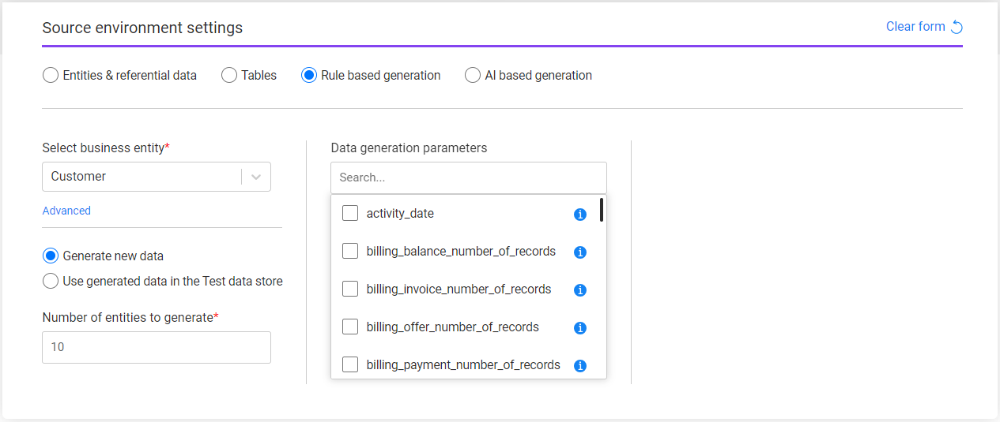
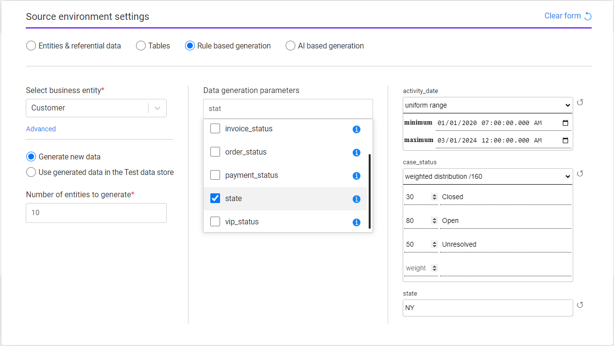
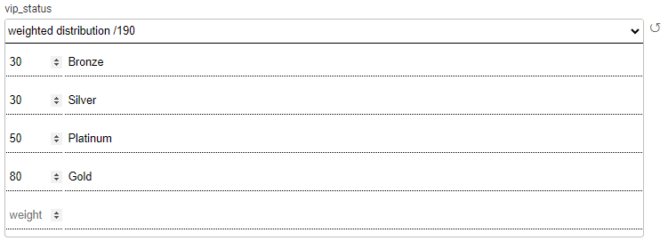

# Task - Source Component - Rule-Based Generation

The TDM supports 2 modes of synthetic entities generation:

- Rule-based generation.
- AI-based generation.

The user can select either one of these methods to generate synthetic entities by the task.

The following information needs to be set for **Rule-based generation**:

- **Business entity** - the task's [BE](https://github.com/k2view-academy/K2View-Academy/blob/Academy_8.0_TDM_9.0/articles/TDM/tdm_gui/04_tdm_gui_business_entity_window.md). Select a BE from the drop-down list of all the TDM BEs. The **Advanced** is an **optional** setting that enables a partial selection of the systems or LUs in the task. Click the Advanced option to open a popup window with the selected BE's Systems and LUs. 
- **Data generation options**:
  - Generate new data - new entities are generated. The generated entities are stored in the Test data store (Fabric). It is possible to populate also the [Target] component in the task to load the generated entities to the target environment.
  - Use generated data in the Test data store - get pre-generated synthetic entities from the Test data store and load them into the target environment (set in the Target component). Set the entities subset in the Subset component and set the target environment in the target environment.

## Generate New Data 

The following attributes need to be set in order to generate new entities:

- Number of entities to generate - this is a mandatory attribute. The number of entities populated by the tester user is [limited by the tester's environment's permission set](10_environment_roles_tab.md#read-and-write-and-number-of-entities) in the Synthetic environment. 
- Data generation parameters - an optional setting.

### Data Generation Parameters

The TDM portal is integrated with the Fabric Broadway editors when populating either the data generation parameters in the Requested Entities task’s tab.

This integration enables the user to select a valid value from a list, to set dates and to set distributed parameters:

### Adding/Removing Data Generation Parameters to the Task 

Check/uncheck the checkbox next to the parameter name in order to select/remove the parameter. You can add a search value to get the required parameter. The selected parameter is added to the window with the default values, if set.

Click the information icon next to the parameter to view an additional information about the parameter.

### Reset the Data Generation Parameter's Value

Click the black Refresh icon next to the parameter's editor to reset your updates and get back to the previous value, if set. The previous value can be the default value or the previous value set by the user when opening and updating a Generate task.

### Data Generation - Distribution Parameters

The distribution parameter generates random values according to input distribution settings. The supported distribution types are **normal**, **uniform**, **weighted** and **constant** (return one value).

The user can edit the distribution type and the related distribution parameters. The distribution parameters are set based on the selected distribution type:

- **Normal** distribution (gaussian) works using **mean** and **stddev** (standard deviation), and can be bound by **minimum** and **maximum** values, both inclusive.

  Example:

  

  In the above example, the generated customers get an invoice balance between 20-200. Most of the generated customers get an invoice balance around 80 with a standard deviation of 5.

   

- **Uniform** distribution returns a random value between the **minimum** and **maximum** values.

  Examples:

  i. The generated customers will have 1-3 cases for each generated parent activity:

  

 

​	ii. The generated activities are created with activity date between the 1-Jan-2020 and 22-Apr-2024.  

- **Weighted** distribution returns a value from the list, based on the value's weight. Weighted distribution uses a 'weights' map, where the keys are the results and the values are positive numbers indicating the weight of the entry of the whole. Both, the distributed values and the weights, need to be populated manually.

  Example:

  

  In the above example, 16% (30/190) of the generated customers get a Bronze status, 16% (30/190) get a Silver status, 26% (50/190) get a Platinum status, and 42% (80/190) get a Gold status.

  

- **costant** distribution returns the populated value. For example: set the number of generated addresses to 1 address per customer:

  

  

​	

