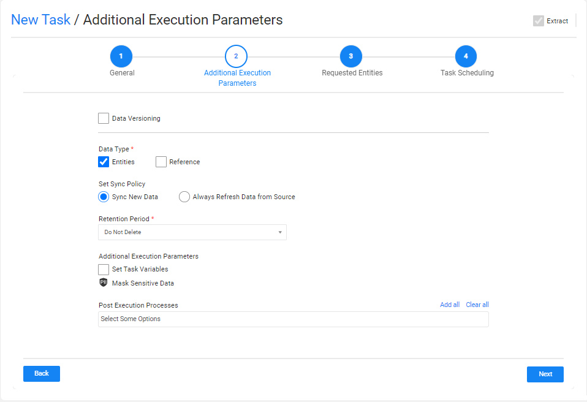
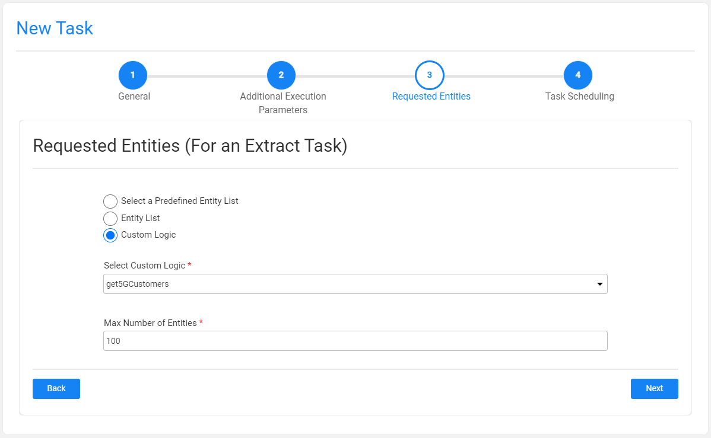

# TDM Extract Task

An Extract task extracts the selected entities and/or Reference tables from the selected source environment. The data can be saved in Fabric (TDM warehouse) for a later use.

An Extract task contains the following tabs:

- [General](14a_task_general_tab.md)
- [Additional Execution Parameters](#additional-execution-parameters-tab)
- [Requested Entities](#requested-entities-tab) - opens if the Data Type contains entities.
- [Task Scheduling](22_task_execution_timing_tab.md)

When checking the **Set Task Variables** setting, a new [Task Variables](23_task_globals_tab.md) tab opens.

When setting the **Data Type** by checking the **Reference** setting, a [Reference tab](24_task_reference_tab.md) opens.

## Additional Execution Parameters Tab

The following execution parameters are set on **Extract tasks**:

### Data Versioning

- Check the checkbox to set the task mode to [Data Versioning](15_data_flux_task.md). 
- Leave the Data Versioning checkbox unchecked to create a regular mode task.

### Data Type

Check the **Entities** checkbox to extract the selected entities and/or the **Reference** checkbox to extract the selected reference tables into the TDM warehouse (Fabric).

Click [here](24_task_reference_tab.md) for more information about the reference handling. 

### Set Sync Policy

This setting enables the user to change the [default LUI sync mode](/articles/14_sync_LU_instance/02_sync_modes.md) (Sync ON) and to extract the LUI from the data source whenever the task is executed (Sync FORCE).

Note that **this setting is only available when the Data Versioning checkbox is clear (regular task)**. If the Data Versioning checkbox *is* checked, each task execution extracts the data from the data source and creates a new LUI.

### Retention Period

The retention period is set on the extracted entities and/or Reference tables. When this period ends, the task's entities and/or Reference tables are **automatically deleted** from Fabric and are no longer available. 

#### Retention Period Values

- **Do not Delete** - do not delete from Fabric. 

- **Do not Retain** - avoid saving the task's entities and/or Reference tables in Fabric (instead of saving and deleting). This option can be used, for example, to run an Extract task on a large subset of entities in order to populate the TDM parameter’s tables on each entity without saving the entities into Fabric.

- Setting of a time measuring unit (minutes/hours/days...) and a value. For example, save the data in Fabric for 2 days. After 2 days the data is automatically deleted from Fabric.

  Note that the **retention period** can be set in **minutes**, **hours**, **days**, **weeks** or **years**, depending on the maximum retention period set in the TDM DB. Both parameters - default retention period and maximum retention period - are set in the [TDM DB](/articles/TDM/tdm_configuration/02_tdmdb_general_parameters.md).

#### Default Retention Period

- Data versioning checkbox is clear - do not Delete.
- Data versioning checkbox is checked - 5 days. A retention period must be set on a Data Versioning Extract task, i.e., the retention period must be set to a value greater than zero when the Data Versioning checkbox is checked.

### Additional Execution Parameters

#### Set Task Variables 

Check to open the Task Variables tab and [set the variable value on a task level](23_task_globals_tab.md).

#### Mask Sensitive Data

TDM 8.1 added this checkbox, which indicates if the source data needs to be masked before it is saved into Fabric. This checkbox has been added to the [Environment window](/articles/TDM/tdm_gui/08_environment_window_general_information.md#mask-sensitive-data) as well and is populated based on the task's source environment. The user can add masking on the task (by checking the clear checkbox) even if the task's source environment is not defined as containing sensitive data. However, the user is not allowed to remove the masking if the task's source environment contains sensitive data.

### Post Execution Processes

Select all, partial or one [post execution process](04_tdm_gui_business_entity_window.md#post-execution-processes-tab) of the selected BE.

## Requested Entities Tab

This tab opens when the task's Data Type includes entities. This tab defines the subset of entities for the task:

The following selection methods are available on extract tasks: 

- **Select a Predefined Entity List**: run the SQL query or the [Broadway flow](/articles/TDM/tdm_implementation/11_tdm_implementation_using_generic_flows.md#step-6---optional---get-the-entity-list-for-an-extract-all-task-using-a-broadway-flow) defined in the [MigrateList MTable](/articles/TDM/tdm_implementation/04_fabric_tdm_library.md#migratelist) translation object for the LU. This option is available only for Admin and Environment owner users.

- **Entity list**: this is the **default option**. Populate the list of entities for the task. The populated entities should be separated with a comma. 

- **Custom logic**: select a [Broadway flow](/articles/TDM/tdm_implementation/11_tdm_implementation_using_generic_flows.md#step-7---optional---build-broadway-flows-for-the-custom-logic--selection-method) in order to both get the entity list for the task and set the maximum number of entities for the task.

  Note that when populating the Custom logic parameters in the task’s tabs, it includes an integration of [Broadway editors](/articles/TDM/tdm_implementation/15_tdm_integrating_the_tdm_portal_with_broadway_editors.md) into the TDM portal, which has been added by TDM 8.0:

  

Notes:

- The maximum number of entities populated by the tester user is [limited by their environment's permission set](10_environment_roles_tab.md#read-and-write-and-number-of-entities). This is the maximum number of entities in the task. 
- The maximum number of entities in the task is limited to the number of entities returned from the Custom Logic flow or by the Max Number of Entities task parameter. For example: if the maximum number of entities in the task is 50, but the custom logic returns 30 entities only, the task will process 30 entities.
- Populate the Entity ID as populated in the source environment. For example, populate the Entities List with 1, 2 in order to extract Customers 1 and 2. The TDM execution process [concatenates the required components](/articles/TDM/tdm_implementation/01_tdm_set_instance_per_env_and_version.md) to each Entity ID when building its LUI.

 

