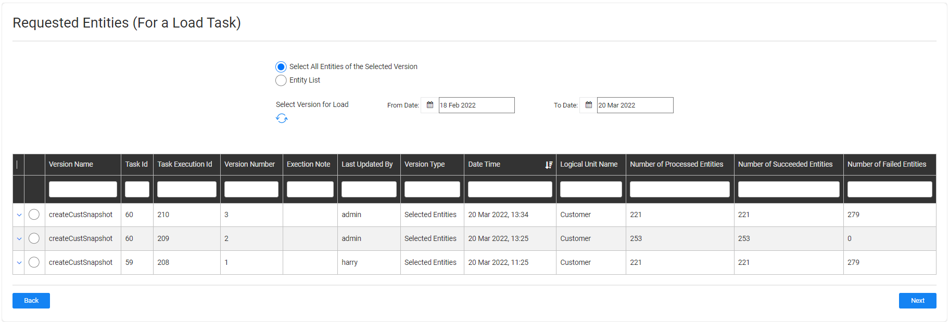
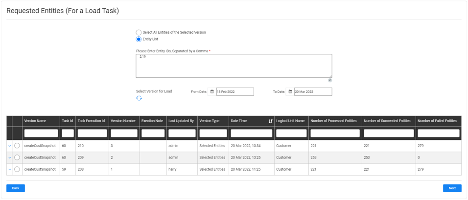

# TDM Load Task - Data Versioning Mode

A Load task contains the **Load** task action and loads (provisions) the task's entities and/or Reference tables to the target environment. A [Data Versioning Load task](15_data_flux_task.md) gets the selected entities or Reference tables from the selected data version created on the source environment, deletes the current data from the target environment,  and reloads the selected data version  to the selected target environment.

A Load task contains the following tabs:

- [General](14a_task_general_tab.md)
- [Additional Execution Parameters](#additional-execution-parameters-tab)
- [Requested Entities](#requested-entities-tab) - opened if the Data Type contains entities.
- [Task Scheduling](22_task_execution_timing_tab.md)

When checking the **Set Task Variables** setting, a new [Task Variables](23_task_globals_tab.md) tab opens.

When checking the **Reference** Data Type setting, a [Reference tab](24_task_reference_tab.md) opens.

## Additional Execution Parameters Tab

The following execution parameters are set on **Load Data Versioning tasks**:

### Data Versioning

- Check to set the task mode to [Data Versioning](15_data_flux_task.md). 

### Data Type

Check **Entities** and/or **Reference** to load them to the target environment selected in the **Provision to Environment** setting.

Note that you must check the Entities Data Type if the [Reserve](/articles/TDM/tdm_architecture/08_entity_reservation.md) Task Action is also checked in the task.

Click [here](24_task_reference_tab.md) for more information about the reference handling. 

### Reservation Period

The reservation period settings are displayed **if the load task also reserves the loaded entities** on the target environment (the Reserve task action is checked together with the Load task action).

Note that when the Reservation Period is set to zero, the entities are reserved for an unlimited period.  

Only Admin and Environment owner users can reserve entities for an unlimited period. Users that are attached to the target environment as testers must set a reservation period. The maximum number of days of a reservation period is set in the **tdm_general_parameters** TDB DB table in the **MAX_RESERVATION_DAYS_FOR_TESTER** parameter.

The start date of the reservation period is the task's execution time. The **reservation period** can be set in **minutes**, **hours**, **days** or **weeks**.

### Reservation Note

This setting has been added by TDM 7.5.2. The user can populate it with a free text. The reservation note is displayed in the [Reserved Entities window](13_reserved_entities_window.md) (Notes fields) and can be used for filtering the reserved entities display. The reservation note can be edited using the Reserved Entities window.

### Additional Execution Parameters

#### Set Task Variables 

Check to open the Task Variables tab and [set the variable value on a task level](23_task_globals_tab.md).

### Post-Execution Processes

Select all, partial, or one [post execution process](04_tdm_gui_business_entity_window.md#post-execution-processes-tab) of the selected BE.

Note:

- The **Set Sync Policy**, **Retention Period**, and **Replace Sequence** settings are not displayed when the Data Versioning is checked as the task gets the selected data version from the TDM warehouse (Fabric) and reloads it to the target 'as is'.

## Requested Entities Tab

This tab is opened when the task's Data Type includes entities. It displays a list of available data versions that can be selected and reloaded to the target environment. By default, the TDM Portal displays a list of the data versions created during the last month. To set a different period, edit the **From Date** and **To Date** settings:

The following selection methods are available on load tasks: 

### Select All Entities of the Selected Version

Reload all the entities in the selected data version into the target environment. The window displays all available versions created in the source environment for the task's LUs. 

This option is **only available for Admin users and the task's target environment owners**. 

### Entity list 

This is the **default option**. Populate the list of entities separated by a comma in the **Entities List** setting.

The TDM displays all available versions created in the source environment for the task's LUs and the selected entities.

Each update on the entities list may change the list of available versions for the task. 

Select a data version and click **Next**. The TDM revalidates the entities list and checks whether each entity and the related child IDs have been successfully synchronized into Fabric in the selected data version. 

#### Notes:

- Only one data version can be selected for a load task.
- The **Version Name** is the **Task Title** of the extract task that created the version.
- The **Date Time** is the execution date of the task. An extract task can be executed multiple times. Each execution creates a separate version and has its own date and time.
- The **Version Type** setting indicates whether the extract task has been created for all entities, or for a selected list of entities.
- The table holding the available versions can be sorted or filtered.
- To update the list of available versions, click **Refresh**.

 

