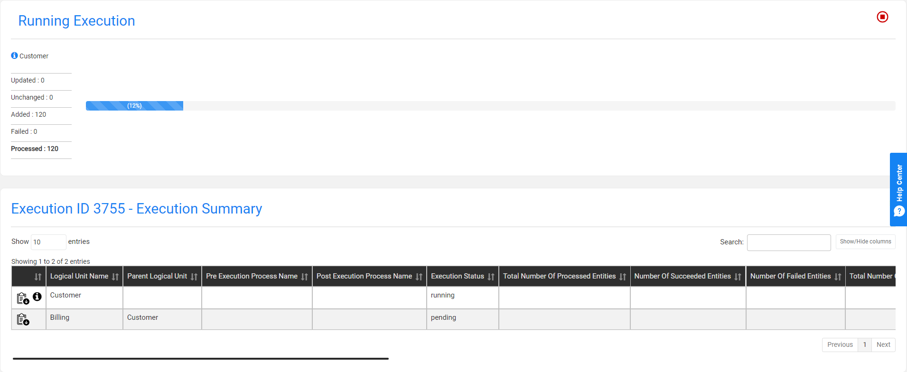

# Task Execution

A task can be executed multiple times. A [Task Execution process](/articles/TDM/tdm_architecture/03_task_execution_processes.md) can be initiated either from the TDM Portal by clicking , a direct call to the [start task execution API](/articles/TDM/tdm_gui/TDM_Task_Execution_Flows_APIs/04_execute_task_API.md), or via a TDM Scheduling process if the task's [Execution Timing](22_task_execution_timing_tab.md) is defined as **Scheduled Execution**.

The TDM Scheduling process checks the **End Date** of the task's scheduling parameters. If the End Date is earlier than the current date, the process cleans the task's **Scheduled Execution** parameters and skips the task execution. 

## Who Can Execute a Task via the TDM Portal?

The following users can execute a TDM task:

- **Admin users**.
- **Environment owners** of the task's environment:
  - **Extract tasks**, the environment owner of the source environment.
  - **Generate tasks**, the environment owner of the Synthetic environment.
  - **Load, Reserve, or Delete tasks**, the environment owner of the target environment.

- **Testers**:
  - The task's creator.
  - Other testers that are related to the same TDM Environment permission set as the task's creator:
    - **Load, Reserve, or Delete tasks**, testers that are related to the same TDM Environment permission set in the target environment as the task's creator.
    - **Extract and Generate tasks**, testers that are related to the same TDM Environment permission set in the source environment as the task's creator. 

## Task Execution Order

A TDM task can include multiple LUs with a flat or hierarchical structure and post execution processes.

The execution of the related task components runs in the following order:

1. LUs, run the LUs from parent to child.  

   Click for more information about the [execution order of hierarchical LUs](/articles/TDM/tdm_overview/03_business_entity_overview.md#task-execution-of-hierarchical-business-entities).

2. Post Execution Processes, run the post execution processes after the execution of the LUs ends. The post execution processes are executed according to their [execution order](04_tdm_gui_business_entity_window.md#post-execution-processes-tab) as defined in the task's BE. 

## Monitoring Task Execution

The TDM Portal displays a list of the task's LUs and post execution processes and the status of the currently running processes.

**Example:**

- Execute and extract the task with the following LUs:
  - CRM, the root LU.
  - Billing is children LU of the CRM LU.

- The CRM LU is executed before the Billing LU:

  

- The Billing LU is executed after the execution of the CRM LU has ended:

  

- The **Logical Units Execution Summary** window displays the summary execution details of each LU or post execution process.

###  Open the Batch Monitoring Window

Click the information icon next to each LU to open the [Batch Monitor](/articles/20_jobs_and_batch_services/18_batch_monitor.md) window for the execution in order to get an additional information and have a better tracking about the task execution. 

## Stop and Resume a Task Execution

A task can be stopped if the processed entities fail due to an error, and can be resumed from the same point once the error has been fixed.  

- Click in the right corner of the **Running Execution** window to stop the execution of the running or pending task's LUs or post execution processes, and to set the status of the task to **stopped**.

- Click  next to a record in **stopped** execution status in the **Logical Unit Summary** to resume the execution of **all** stopped task LUs and post execution processes:

  

## Holding Task Execution

Occasionally you may need to temporarily set a task to On Hold. For example, if the testing environment is temporarily down, to hold all task executions on an environment until the testing environment is up again and to then reactivate the tasks for this environment.

Hold or Activate task activities are enabled only for Active tasks. When a task is deleted (set to Inactive), its task execution status cannot be modified.

Tasks with an **on-Hold** task execution status cannot be executed.  

Hold and Activate task buttons are displayed on the Tasks screen of each task:

- To set the task to On Hold (pause), click .
- To activate a task execution status, click .

### Who Can Hold or Activate a Task?

- Admin user, can hold or activate all active tasks.
- Environment owner user, can hold or activate all active tasks in their environment.
- Testers, can hold or activate their active tasks.

**Notes:**

- To execute a scheduled task on demand, click . 

- Both the TDM Portal and TDM Scheduling processes initiate an execution request in the TDM DB. The TDM task execution process gets pending execution requests and executes the tasks.

  Click for more information about the [TDM task execution process](/articles/TDM/tdm_architecture/03_task_execution_processes.md).

- A task cannot be executed several times in parallel. An additional execution can be initiated only if the previous execution has ended.

- The TDM Scheduling process skips running tasks.

- The TDM Scheduling process skips On Hold tasks.

  

