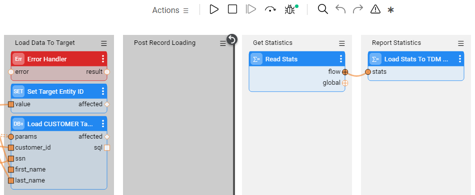

# TDM Error Handling and Statistics Flows

The TDM library includes a set of generic flows for error handling and statistics gathering that are based on Broadway capabilities and are tailored for TDM business requirements. 

These generic flows gather errors and statistics during task execution and populate them into dedicated tables. This data is used for monitoring  TDM tasks and creating TDM execution reports.

### How Do I Perform Error Handling in TDM?

The TDM library includes two utility flows that handle errors during the execution of TDM tasks:

* PopulateTableErrorsWithFailed.flow
* PopulateTableErrorsWithReject.flow

Both utilities invoke the internal **PopulateTableErrors.flow** to populate data about errors into the **task_exe_error_detailed** table. The difference between the utilities is that PopulateTableErrorsWithFailed.flow sets on a session level:

~~~
ENTITY_STATUS = failed 
~~~

PopulateTableErrorsWithFailed.flow also sets the error category as *Entity Failed* in the **task_exe_error_detailed** table, while PopulateTableErrorsWithReject.flow sets a record as *Record Rejected*.

The error handling utility is invoked from each Load flow's **Load Data To Target** Stage. An error can be suppressed in order to continue a task execution and reach the statistics gathering step.

By default, the **PopulateTableErrorsWithFailed** is invoked and the **Suppress** setting is unchecked, i.e. the entity is rejected due to the error:

 If a record needs to be rejected instead of failing an entire entity, replace the Inner flow name with **PopulateTableErrorsWithReject** and check the **Suppress** setting. 

[Click to learn how to use the ErrorHandling Actor](/articles/19_Broadway/actors/06_error_handling_actors.md#how-do-i-use-the-errorhandler-actor).

### How Do I Gather Statistics in TDM?

#### TDM Task Execution Report

The [task execution report](/articles/TDM/tdm_gui/27_task_execution_history.md#generating-a-task-execution-summary-report) includes the Statistics Report tab that compares the number of records in each table in the source and target environments.  

The TDM library includes the **StatsLoader** Broadway actor that populates the statistics data into **task_exe_stats_detailed** TDM DB table. The generated load flows include the following Broadway actors:

- **StatsReader** : gets the load statistics from the **DbLoad** actor which loads the data to the target DB. 
- **StatsLoader** : gets the statistical information from the StatsReader and populates them in task_exe_stats_detailed TDM DB table. This table is extracted by the [task execution report API](/articles/TDM/tdm_gui/TDM_Task_Execution_Flows_APIs/07_get_task_execution_reports_APIs.md#get-task-execution-summary-report) to generate the the Statistics Report tab of the Task Execution Report. 

See an example below:

#### TDM Custom TMX Statistics

Fabric provides [JMX metrics](/articles/34_JMX_statistics/01_JMX_overview.md) to enable comprehensive and low-resolution monitoring and management of applications. The JMX metrics can be accessed using monitoring tools such as Grafana. In addition Fabric enables adding [customized JMX statistics](/articles/34_JMX_statistics/03_JMX_custom.md) for a better monitoring. 

TDM 7.5.3 adds the following customized TMX metrics to have a better monitoring on the TDM executions. The metrics are extracted from the TDMDB by the TDM LU sync:

- **TotalLoadedRecordsPerLoadFlow** - number of records loaded to the target DB by per load Broadway flow. The following information is provided:

  - LU name (luName)
  - Table name (tableName)
  - Flow name (flowName)
  - Number of records (RecCount)

  Note that this metric has been added since the **broadwayFlow** JMX metric provides data about the number of flow's execution and not about the total number of records, loaded by each flow. 

- **TaskExecutionPerBE** - number of task executions per Business Entity (BE). The following information is provided:

  - BE name (beName)
  - Number of executions (RecCount)

- **TotalTaskExecutions** - total number of task executions. Note that each task execution is accumulated as one execution even if the task contains multiple LUs.

- **TotalTaskExecutionsPerStatus** - total number of task executions per execution status. Note that each task execution is accumulated as one execution even if the task contains multiple LUs. 

