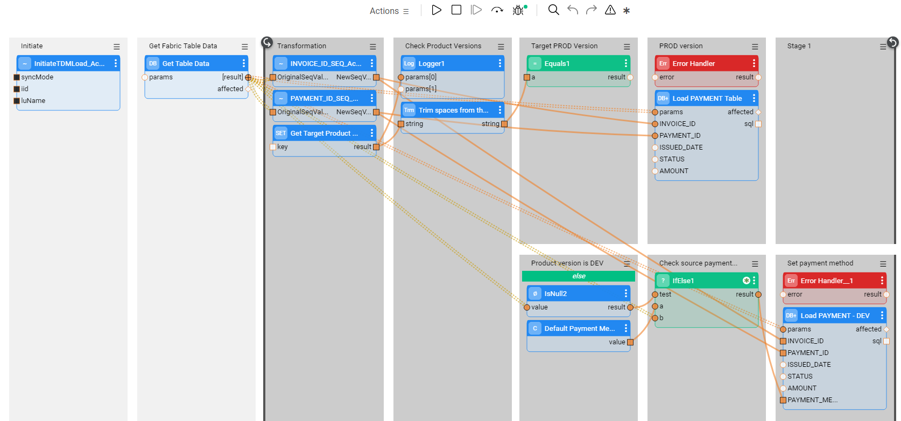

# TDM Implementation - Supporting Different System Versions

During a project's lifecycle, there may be several versions of the data source structure and relevant software. As a result, TDM may need to support several different source and target systems, each having several different versions of the data sources structures. For example, a development environment may have new tables and fields as opposed to the production environment. These changes require updates of the TDM implementation.

This article describes the working procedure for such updates of the TDM implementation to support changes in the source and target systems. They include updates of TDM Globals of System (product) Versions, updates of LU Schemas and updates of Broadway Load Flows. 


## TDM Globals of System Versions

A  [TDM System](/articles/TDM/tdm_gui/05_tdm_gui_product_window.md) represents a system or an application installed in a source or target environment. The list of possible system versions must be set on each TDM System. When adding a TDM System to a TDM environment in the TDM GUI, the [system version must be set in the environment](/articles/TDM/tdm_gui/11_environment_products_tab.md#environment-product-window).

The [TDM Execution Process](/articles/TDM/tdm_architecture/03_task_execution_processes.md) sets the following Globals imported from the [TDM Library](04_fabric_tdm_library.md) for each LU. The system versions are based on the system's version of the task's environments: 

- **TDM_SOURCE_PRODUCT_VERSION**, populated by the system's version of the task's source environment. 

- **TDM_TARGET_PRODUCT_VERSION**, populated by the system's version of the task's target environment.

The TDM implementation can get the values of these Globals in order to check the source and target system version of each execution.

## Update LU Schema

The data source of the LU schema may have been updated, and consequently requires editing of the LU schema. When doing so, the following notes and caveats must be taken into account: 

### Adding or Removing LU Tables

Adding or removing LU tables to/from the LU Schema must be implemented manually.

### Adding New Columns to an LU Table 

The new columns can be added manually or added by clicking the [Update Tables from Database](/articles/03_logical_units/18_LU_schema_refresh_LU_options.md) green icon in the LU Schema window .

### Removing Columns From an LU table

Removing columns from an LU table must be implemented manually.

### Support of Multiple System Versions

It could be that new columns or new tables have been added to a table by a more recent system version. 

Examples:

- Adding a new table, PAYMENT_DETAILS, to the  Development environment. This table did not exist in the Production environment.

- Adding the PAYMENT_METHOD column to the PAYMENT table in the Development environment. This column did not exist in the PAYMENT table of the Production environment.

Adding new LU tables, and adding new columns to an LU table are described in more detail below:  

  #### Adding a New LU Table

Add [a decision function](/articles/14_sync_LU_instance/05_sync_decision_functions.md) to check the TDM_SOURCE_PRODUCT_VERSION Global. The decision function returns a  **true** value if the table exists in the source environment. The source environment version is taken from  **TDM_SOURCE_PRODUCT_VERSION** Global.

  Here is one example of source code to implement this: 


```java
String luName = getLuType().luName;
String tdmSourceProdVersion = "" + ludb().fetch("SET " + luName + ".TDM_SOURCE_PRODUCT_VERSION").firstValue();

Boolean decision = false; 
if(tdmSourceProdVersion.equals("1.5") || tdmSourceProdVersion.equals("2")
{
	decision = true;
}
```


  #### Adding New Columns to an LU Table  

  - Define multiple populations in the LU table. Each population must run on its source environment. The source environment version is taken from  **TDM_SOURCE_PRODUCT_VERSION** Global. Note that new columns can be selected by the query only when they already exist in the source environment.

    Example:

    Add a PAYMENT_METHOD column to the PAYMENT table in the Development environment. This table did not exist in the Production environment. 

    In this case, we create two table populations.

    **Examples:**

    

    **LU Populations are based on Broadway flows:**

    1. Production table population, which runs when the TDM_SOURCE_PRODUCT_VERSION Global is PROD. This population does <b>not</b> select the PAYMENT_METHOD from the source and leaves the PAYMENT_METHOD empty. The first stages of the flow check the TDM_SOURCE_PRODUCT_VERSION and run the next stages only if the TDM_SOURCE_PRODUCT_VERSION Global is PROD:

       

    2. Production table population, which runs when the TDM_SOURCE_PRODUCT_VERSION Global is DEV. This population selects the PAYMENT_METHOD from the source and populates in in the LU table. The first stages of the flow check the TDM_SOURCE_PRODUCT_VERSION and run the next stages only if the TDM_SOURCE_PRODUCT_VERSION Global is DEV:

       

    

    **LU Populations are based on Db Queries:**

    

      1. Production table population, which runs when the TDM_SOURCE_PRODUCT_VERSION Global is PROD. This population does <b>not</b> select the PAYMENT_METHOD from the source and leaves the PAYMENT_METHOD empty:

         

         We add a new **decision function**: fnDecisionProductionProductVersion to the Production population:

         ```java
         String luName = getLuType().luName;
         String tdmSourceProdVersion = "" + ludb().fetch("SET " + luName + ".TDM_SOURCE_PRODUCT_VERSION").firstValue();
         
         Boolean decision = false;
         
         if(tdmSourceProdVersion.equals(PRODUCTION_PRODUCT_VERSION))
         {
         	decision = true;
         }
         return decision;
         ```

         

      2. Development  table population, which runs when TDM_SOURCE_PRODUCT_VERSION Global is DEV. This population selects the PAYMENT_METHOD from the source and populates the PAYMENT_METHOD column of the LU table:

         

         We add a new **decision function**: fnDecisionDevProductVersion to the Development population:

         ```java
         String luName = getLuType().luName;
         
         String tdmSourceProdVersion = "" + ludb().fetch("SET " + luName + ".TDM_SOURCE_PRODUCT_VERSION").firstValue();
         
         Boolean decision = false; 
         if(tdmSourceProdVersion.equals(DEVELOPMENT_PRODUCT_VERSION))
         {
         	decision = true;
         }
         return decision;
         ```

  - Note that it is recommended to create the project's functions in a separate [Logic File](/articles/04_fabric_studio/09_logic_files_and_categories.md) and avoid adding them to the TDM Logic file, since the TDM logic file already contains the TDM product functions.

## Update Broadway Load Flows

- New table or new table's columns must be loaded to the target environment only if they exist in the target environment.

- The target environment version is taken from  **TDM_TARGET_PRODUCT_VERSION** Global.

Example:

  - Here, we populate the PAYMENT_METHOD column of the PAYMENT table only when loading the data to a Development target environment. Set a default value in the PAYMENT_METHOD if the source environment does not have this column:

     


[](12_tdm_error_handling_and_statistics.md)[](14_tdm_implementation_supporting_non_jdbc_data_source.md)
