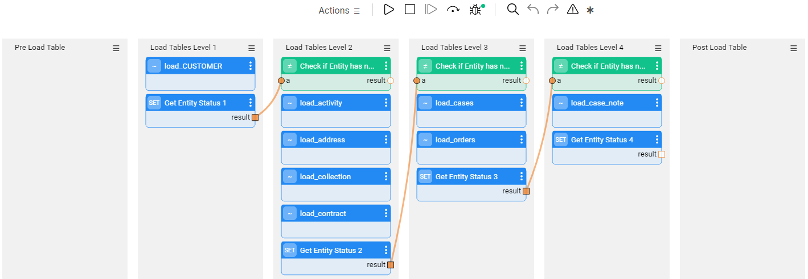

# TDM Implementation - Supporting Non JDBC Data Sources

## How to Define the Entity List For Extract All Entities Tasks?

Create a Broadway flow to get the list of entities from the data source:

- Stage 1: get the list of entities.
- Stage 2: call **insertToLuExternalEntityList** actor (imported from the TDM library) in a loop (iteration) to insert all entities into entity list Cassandra table. Set a [Transaction](https://github.com/k2view-academy/K2View-Academy/blob/Academy_6.5_TDM_7.3/articles/19_Broadway/23_transactions.md#transaction-in-iterations) in the loop to have one commit all all iterations.

Populate the Broadway flow in the [trnMigrateList](https://github.com/k2view-academy/K2View-Academy/blob/Academy_6.5_TDM_7.3/articles/TDM/tdm_implementation/04_fabric_tdm_library.md#trnmigratelist) translation.

Click [here](11_tdm_implementation_using_generic_flows.md#step-6---optional---get-the-entity-list-for-an-extract-all-task-using-a-broadway-flow) for more information how to populate the entity list based on a non JDBC data source.

## Building the LU Tables Populations

### Step 1- Main Source LU Table

The population of the main source LU table must be generated based on [populationRootTable.pop.flow template](articles/TDM/tdm_implementation/05_tdm_lu_implementation_general.md#step-3---add-the-source-lu-tables-to-the-lu-schema) imported from the TDM Library:

- Right click the table name > **New Table Population Flow From Template > populationRootTable.pop.flow**. A popup window is opened.
- Populate the popup window's settings as follows:
  - **File Name**: populate the file name by [LU Table Name].[flow name]
- No not populate the **TABLE_NAME** , **KEY**, and the **SOURCE_INTERFACE** parameters when populating the main source LU table based on a non JDBC data source.
- The generated flow is created with an empty source query in the **Source** stage. Replace the empty **sourceDbQuery** in the **Source** stage by the updated actor to extract the data from the data source and link it to the main source LU table in the **LU Table** stage.

### Step 2 - Other LU Tables

Create Broadway flows to populate the other LU tables.

## Building the Broadway TDM Flows

### Step 1- Build Load and Delete Flows

The **createLoadTableFlows** and **createDeleteTableFlow** flows call the **getDbTables** function to get the target JDBC structure and therefore cannot be used for a non JDBC target.  Therefore the load and delete flows need to be created manually:

- A separate load flow for each target object. The data is taken from the related LU table. Add [sequence](11_tdm_implementation_using_generic_flows.md#update-the-load-flows-with-the-sequence-actors) and [masking](tdm_implementation/11_tdm_implementation_using_generic_flows.md#step-5---mask-the-sensitive-data) handling if needed.

- A separate delete flow of each target object. The target keys are taken from the [**TAR_** LU tables](08_tdm_implement_delete_of_entities.md).

- **LoadAllTables** flow:  this flow execute the inner load flows on each target object in the right order. 

  See an example below:

  

​		

​		

​		Note that the **Get Entity Status** actors check the **ENTITY_STATUS** value and the flow runs the load flows of the next stage if the ENTITY_STATUS is not **failed**.

- **DeleteAllTables** flow:  this flow execute the inner delete flows on each target object in the right order. 

  See an example below:

### 		

### Step 2 - Generate Build Load and Delete Flows 

Once all load and delete flows are ready, create an orchestrator using the [TDMOrchestrator.flow](11_tdm_implementation_using_generic_flows.md#step-4---create-the-tdmorchestratorflow-from-the-template) template.

