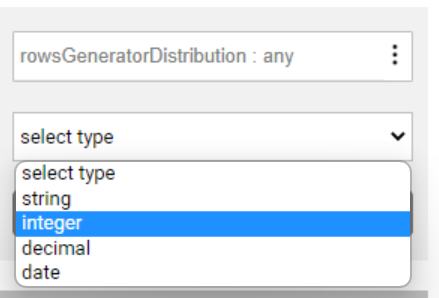
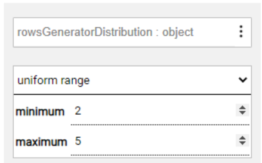
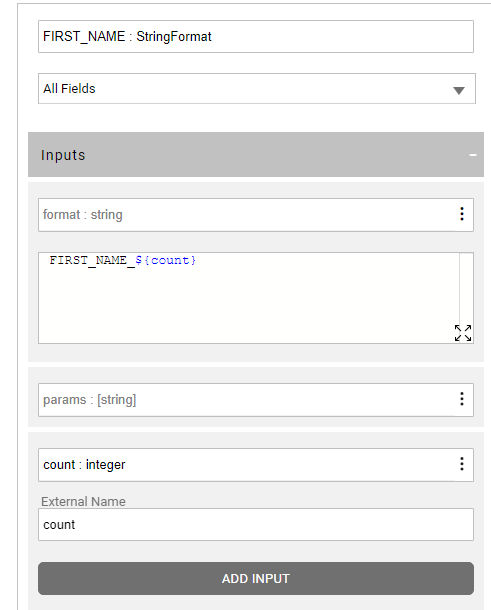

# Data Generation Implementation

The TDM data generation creates synthetic entities. The synthetic data is populated into the LU tables: an LU table can be populated with either source data or generated synthetic data.  

## Implementation of LU Populations 

The LU population must be based on a Broadway flow (instead of a DB Query or a root function) to support synthetic data generation. Thus, the **sourceDbQuery** Actor was enhanced by Fabric 7.1 to support either one of the following two population modes: a DB Select query from a data source or a synthetic population. The population mode is set based on the **ROWS_GENERATOR** key (session variable). If it is set to **true**, the **sourceDbQuery** Actor runs the data generation inner flow to generate the synthetic records. The number of synthetic records created for each parent key is set based on the **rowsGeneratorDistribution** input Actor.

### LU Population Flows - Implementation Steps

1. Verify that the LU tables' populations are based on a Broadway flow in order to support the synthetic data generation. Note that you need to use the **populationRootTable.pop.flow** for the main source LU table. For other LU tables, generate the default population flow.


2. **Optional** - **edit the default number of generated synthetic records**: the data generation process needs to 'know' how many records have to be generated on each LU table. For example, indicate how many addresses should be generated for a synthetic customer.
  
   The **rowsGeneratorDistribution** input argument of the **sourceDbQuery** Actor (named *Query*) in each LU table's population flow sets the number of generated records for each table. By default, it generates 1 record for the main LU table and 1-3 records for the remaining LU tables. The values of 1 and 3 are set in **TABLE_DEFAULT_DISTRIBUTION_MIN** and **TABLE_DEFAULT_DISTRIBUTION_MAX** [TDM general parameters](/articles/TDM/tdm_configuration/02_tdmdb_general_parameters.md#data-generation-parameters).

   *Edit options:*

   The following methods can be used to override the range for the number of generated records in the TDM implementation:
   
   i. Edit the default range for the number of generated records (set to 1-3 by default): update the
   **TABLE_DEFAULT_DISTRIBUTION_MIN** and **TABLE_DEFAULT_DISTRIBUTION_MAX** parameters in the TDM DB. This edit will impact the number of generated records on all LU tables except for the main source LU table.
   
   Example:
   Run the following Update statements in order to set the number of generated records to 2-4:
   
    ```sql
    UPDATE tdm_general_parameters set param_value = '2' where param_name = 'TABLE_DEFAULT_DISTRIBUTION_MIN';
   
   UPDATE tdm_general_parameters set param_value = '4' where param_name = 'TABLE_DEFAULT_DISTRIBUTION_MAX';
    ```
   

   ii. Edit the **rowsGeneratorDistribution** input argument argument in the LU population flow to set a different range (minimum and maximum numbers) or a distribution type (the default is **Uniform distribution**) of generated records for a given LU table, if needed. For example: generate customers with 3-6 contracts. The data generation randomly generates a number of records within this range:

   - Set the type of the distributed value to **integer**:

     
   
   

   - Then, edit the distribution type and/or the minimum and maximum values, as seen in the below example:

     
   
     
   
   Click [here](/articles/TDM/tdm_implementation/15_tdm_integrating_the_tdm_portal_with_broadway_editors.md#distribution-editor) for more information about the distribution types. 
   
   - If you edit the **rowsGeneratorDistribution**, you must set it to be **External parameter**  with the following naming convention: 
   
   ```
   [lu name]_[lu table name]_number_of_records
   ```
   
   Note that if the **rowsGeneratorDistribution** input argument is not edited, it is automatically generated behind the scenes as an [external parameter](#external-business-parameters) with the following naming convention: 
   
   ```
   [lu name]_[lu table name]_number_of_records
   ```
   
   For example: crm_address_number_of_records. 
   
   The external parameter **enables the user to override the range for the number of generated records**  for each table in the TDM task. For example, ask to generate customers with 2-4 addresses and 3-6 contracts each. 

## Implementation of Data Generation Flows 

The **sourceDbQuery** Actor (automatically added to the LU population flow and named *Query*) runs an inner data generation flow to generate synthetic records for data generation tasks.
The data generation flows must be created on each source LU table to support synthetic data generation.

The data generation flow must have the following naming convention:

```
${population name}.population.generator
```

For example: activity.population.generator

Note that a synthetic data generation task execution sets the **ROWS_GENERATOR** key (session variable) to **true**, which triggers the execution of the data generation inner flow on each LU table.


### Data Generation Flows - Implementation Steps

#### 1. Sequence handling 

The **tdmSeqList** and **TDMSeqSrc2TrgMapping** [sequence](11_tdm_implementation_using_generic_flows.md#step-2---create-sequences) tables must be populated before generating the data generation flows. 

This is required in order to add a sequence generation in the data generation flow for sequence fields (set in the **TDMSeqSrc2TrgMapping** table). The generated flow sets the **sequenceId** input argument, which is created in the TDM DB for the generated ID with the following naming convention:

```
Gen_[the sequence name in TDMSeqSrc2TrgMapping]
```

**Example:**

The customer, contract and address tables of the CRM LU have the following sequence mapping: 


The data generation flows of these tables create the gen_customer_id_seq, gen_address_id_seq, and gen_contract_id_seq DB sequences in the TDM DB and populate the customer_id, address_id, and contract_id fields based on the generated sequences.


#### 2. Generate the data generation flows for the LU table
- Deploy both the **LU**, for which you need to generate the data generation flows, and the **TDM LU** to Fabric debug server.
- Open the **createGenerateDataTableFlows** flow imported from the TDM library.
- Populate the **LU_NAME** and **OVERRIDE_EXISTING_FLOWS** input parameters. 
- Run the flow to create the data generation flows for the LU tables, except for the tables populated in the [TDMFilterOutTargetTables](/articles/TDM/tdm_implementation/11_tdm_implementation_using_generic_flows.md#step-1---define-tables-to-filter-out), whose **generator_filterout** is checked (true). The data generation flows are automatically created in the **GeneratorFlows** subdirectory, under the Broadway directory of the LU.
- Note that you can also run the [createAllFromTemplates flow](11_tdm_implementation_using_generic_flows.md#step-3---create-load-and-delete-flows) to generate the data generation flows together with the target LU tables and the load and delete flows for the LU.

The data generation flows are created with the following logic:

- IDs:
  - The data generation flow sends the parent IDs to the child table's population based on the parent-child LU schema definition.
  For example: the Address LU table is the Customer's LU table child. It is linked to the Customer LU table by the customer_id field. A new customer_id sequence is generated for the Customer LU table. The Address' data generation flow gets the **parent_row** as the input and maps the parent customer_id in the Address record.

  - IDs that are not linked to a parent LU table are populated by the Sequence Actors based on the fields mapped in **TDMSeqSrc2TrgMapping**.

- Other fields are populated with synthetic data. By default, this process utilizes the data generation Actors based on the fields' data type. Note that these default data generation Actors are selected based on the mapping defined in the **GenerateDataDefaultFieldTypeActors** constTable (imported from the TDM library under the Shared Objects). This table can be edited to change the default Actors mapping and should be edited before the creation of the data generation flows.

- The data generation flow output contains a list of fields that are sent to the related LU population flow and are loaded to the LU table as a row column. Note that the data generation flow is called by a loop and returns a single record on each call. The loop on the parent rows as well as the loop on each parent ID is handled by default by the [rowsGenerator Actor](/articles/19_Broadway/actors/07a_data_generators_actors.md#rowsgenerator). 

  

#### 3. Edit the data generation flow

 The following manual updates may be required on the data generation flows:

##### Data Generators

- Replacement of the default data generation Actors with other [data generators](/articles/19_Broadway/actors/07a_data_generators_actors.md) or custom inner flows.

##### PII Fields

- In general, **it is recommended to populate the PII fields in the data generation flow** and to avoid overriding them with the Masking Actors in the LU population flow. Such population enables exposing PII fields as [external business parameters](#external-business-parameters) for the data generation tasks without overriding their values (as set by the user) by the Masking Actors in the LU population.
- Verify that the [Masking Sensitive Data](/articles/TDM/tdm_gui/08_environment_window_general_information.md#masking-sensitive-data) checkbox is clear for the **Synthetic** environment in the TDM Portal, in order to avoid the masking of PII fields in the LU population flows for data generation tasks.
- TDM 8.1 added a new Actor: **GenerateConsistent**. This Actor inherits the **Masking** Actor, but it has its own **category** value: **generate_consistent**. Using this Actor in the data generation flow enables the following:
  - The TDM execution process sets the **generate_consistent** key to **true** on data generation tasks. The **enable_masking** key is set to **false** if the It is recommended to leave the [Masking Sensitive Data](/articles/TDM/tdm_gui/08_environment_window_general_information.md#mask-sensitive-data) checkbox of the **Synthetic** environment is clear. The setting of the **generate_consistent** to **true** and **enable_masking** to **false** on data generation tasks is needed in order to ensure that the data generation flow generates synthetic values on PII fields and the Masking Actors in the LU population do not override the generated synthetic values of the PII fields.
  - The new Actor does not require having an input value since there is no original value for newly generated synthetic entities.
  - The **GenerateConsistent** Actor does not have an input value. Therefore, if you have a PII field that exists across LUs and is set in multiple records in the LUI, you need to use a **Masking** Actor instead of the **GenerateConsistent** Actor.  For example: a customer can have multiple contracts and each contract needs to have a different name. The contracts exist in both LUs: CRM and Billing. Populate the Masking Actor's input parameters in the data generation flow as follows:
    - **value**: populate it with an initial value of the field name + the record number. For example: first_name_1, first_name_2, etc.. . The record number is sent to the data generation flow by the RowsGenerator Actor in the **count** parameter. See example below:
      
    - **category**: populate it with **generate_consistent** value.
  
- PII fields can vary in their incidence and in their need for referential integrity (consistency). Each scenario requires a different implementation approach.

  Example: The First Name and Last Name are located in both LUs - CRM and Billing. Each LU represents a different system. It is required to keep the same combination of the First and Last Names in both LUs for a given customer.

  The following table describes the implementation recommendations for each scenario: 

<table width="900pxl">
<tbody>
<tr>
<td width="250pxl">
<p><strong>PII field incidence</strong></p>
</td>
<td width="150pxl">
<p><strong>Referential integrity</strong></p>
</td>
<td width="500pxl">
<p><strong>Implementation Recommendation</strong></p>
</td>
</tr>
<tr>
<td width="250pxl">
<p>The PII field exists only in one LU table</p>
</td>
<td width="150pxl">
<p>N/A</p>
</td>
<td width="500pxl">
<p>Use a data generator Actor to generate a random synthetic value</p>
</td>
</tr>
<tr>
<td width="250pxl">
<p>The PII field exists in multiple tables in the LU</p>
</td>
<td width="150pxl">
<p>N</p>
</td>
<td width="500pxl">
<p>Use a data generator Actor to generate a random synthetic value</p>
</td>
</tr>
<tr>
<td width="250pxl">
<p>The PII field exists in multiple tables in the LU</p>
</td>
<td width="150pxl">
<p>Y</p>
</td>
<td width="500pxl">
<p>2 alternatives:</p>
<p>1. Use a data generator Actor for one of the field's instances and then select the generated value and populate it into the remaining instances.</p>
<p>2. Use the new TDM 8.1 Actor - <strong>GenerateConsistent&nbsp;</strong> - for all the field's instances to keep the referential integrity of the instances.</p>
</td>
</tr>
<tr>
<td width="250pxl">
<p>The PII field exists in multiple LUs</p>
</td>
<td width="150pxl">
<p>N</p>
</td>
<td width="500pxl">
<p>Use a data generator Actor to generate a random synthetic value</p>
</td>
</tr>
<tr>
<td width="250pxl">
<p>The PII field exists in multiple LUs</p>
</td>
<td width="150pxl">
<p>Y</p>
</td>
<td width="500pxl">
<p>Use the new TDM 8.1 Actor - <strong>GenerateConsistent&nbsp;</strong> - for all the field's instances to keep the referential integrity of the instances.</p>
</td>
</tr>
</tbody>
</table>


​	Click [here](/articles/19_Broadway/actors/07_masking_and_sequence_actors.md) for more information about the masking Actors.

##### External Business Parameters

- Add external business parameters to the data generation flow, such as City and State, to enable the user to set their values in the TDM task's parameters if the user wishes to override the parameter's default value as set in the TDM implementation. The editor of the parameter depends on the parameter type. Spaces and special characters, except for an underscore, must not be included in the External Name setting. 

  Click [here](15_tdm_integrating_the_tdm_portal_with_broadway_editors.md) for more information about the integration of the TDM portal with the Broadway editors and the implementation guides for MTable and Distribution parameters.

##### Handle the Loop over the Number of Records

There are several optional modes for the data generation inner flow:

- **Row by row** - the inner flow can return a single row and let the RowsGenerator Actor handle parent rows and number of rows per parent. The flow can return either multiple results that will serve as the row columns or a single result named **result** of a map type. 
- **Rows per parent** - if the inner flow returns a single result named **result** with a **collection of maps**, the Actor will collect them and move to the next parent row.
- **Handle all parent rows** - a flow can traverse the parent_rows and return a **collection of maps**. The Actor will return these rows and will not call the inner flow again.

The data generation flow returns multiple results that will serve as the row columns and it is executed in the **row by row** mode. You can edit the data generation flow to be executed in either the **rows per parent** or the **handle all parent rows** modes as explained above.

For example, generating 2-5 open cases and 1-6 close cases per activity requires using the 'rows per parent' mode.

Click [here](/articles/19_Broadway/actors/07a_data_generators_actors.md#rowsgenerator) for more information and examples about the RowsGenerator Actor.


[](15_tdm_integrating_the_tdm_portal_with_broadway_editors.md)[](tdm_fabric_implementation_environments_setup.md)
